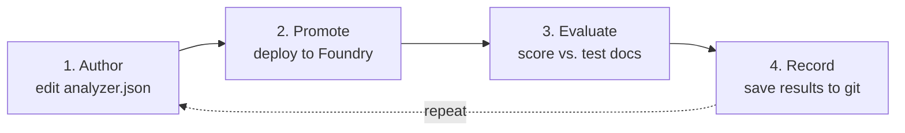
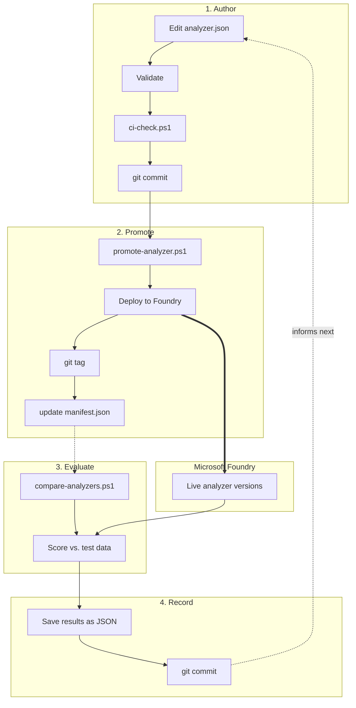
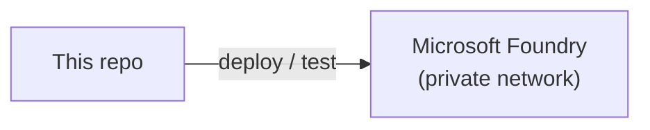

# ContentUnderstandingOps

A simple, version-controlled way to manage Microsoft Foundry Content Understanding analyzers.

Think of it like this: **git is where analyzers are designed and tested. Azure is where they run.**

---

## The one rule to remember

| | Use for | Treat as |
|---|---|---|
| **Foundry Studio** | Building/labeling analyzers in `dev` only | A design tool, not a deployment target |
| **This repo** | Everything from `test` onward | The source of truth for every environment |

Studio is genuinely useful — it's the easiest way to design an analyzer's fields and label
training documents. Use it freely in `dev`. When you're happy with the result, **build the
analyzer in Studio, then use its "Download" option to export the analyzer JSON**, and commit
that file as `analyzers/<family>/analyzer.json`. From that point on, this repo's scripts are
what deploy it everywhere else — `test`, `prod`, etc. are promoted via `promote-analyzer.ps1`,
never edited by hand in Studio.

**Why draw the line there?** Studio has no version history and no tests, so it's fine for fast
iteration in one environment. But once other environments matter, deployments need to be
repeatable and reviewable — that only works if a git commit, not a person clicking in a UI, is
what produces each environment's analyzer.

---

## Labeled data travels with the analyzer

Some analyzers reference **labeled training data** (`knowledgeSources` in `analyzer.json`)
that you created by labeling documents in Studio. That data lives in a **storage account**
attached to Content Understanding — it is *not* embedded in `analyzer.json`, only a pointer to
it is (`containerUrl` + `prefix`).

```json
"knowledgeSources": [
  {
    "kind": "labeledData",
    "containerUrl": "https://<storage-account>.blob.core.windows.net/<container>",
    "prefix": "labelingProjects/<project-id>/train"
  }
]
```

Because `containerUrl` points at *one* environment's storage account, the labeled data itself
must be **copied to each environment's storage** before an analyzer that depends on it is
promoted there — the analyzer definition alone isn't enough.

```powershell
# 1. Copy the labeled blobs from dev's storage to test's storage (same prefix in both)
pwsh -File .\scripts\copy-labeled-data.ps1 -SourceEnvironment dev -DestinationEnvironment test `
  -Prefix "labelingProjects/<project-id>/train"

# 2. Now promote as usual - promote-analyzer.ps1 automatically rewrites containerUrl to
#    the target environment's storage (from environments.json), so the same analyzer.json
#    works unmodified in every environment
pwsh -File .\scripts\promote-analyzer.ps1 -Environment test -Family <family> -Notes "..."
```

---

## Read next

| Doc | What it covers |
|---|---|
| [`docs/mlops-pipeline.md`](docs/mlops-pipeline.md) | How the 4-step pipeline works |
| [`docs/azure-foundry-architecture.md`](docs/azure-foundry-architecture.md) | The Azure setup analyzers run on |
| [`analyzers/README.md`](analyzers/README.md) | List of analyzers and their status |
| [`schemas/README.md`](schemas/README.md) | How `analyzer.json` gets validated |

---

## The 4-step pipeline



| Step | What happens | Command |
|---|---|---|
| 1. **Author** | Edit `analyzer.json` like normal code | *(just edit + commit)* |
| 2. **Promote** | Deploy it to Foundry as a new, permanent `analyzerId` — old ones stay live too | `promote-analyzer.ps1` |
| 3. **Evaluate** | Send real test PDFs through Azure and score extracted fields vs. known answers | `compare-analyzers.ps1` |
| 4. **Record** | Save the score as a JSON file in git — accuracy history is just `git log` | *(done automatically)* |

Full details: [`docs/mlops-pipeline.md`](docs/mlops-pipeline.md).

<details>
<summary>Show detailed pipeline diagram</summary>



</details>

---

## The Azure setup (short version)

Analyzers run on a private Microsoft Foundry account. Only the Content Understanding API is
used by this pipeline — nothing else needs to be touched.



Full inventory + diagram: [`docs/azure-foundry-architecture.md`](docs/azure-foundry-architecture.md).

---

## Environments (dev/test/prod)

Each environment is a **separate Foundry account** with its own endpoint, its own storage for
labeled data, and its own `manifest.<env>.json` per family. Add entries to
[`environments.json`](environments.json) as you get more accounts.

> **Merging a branch does not deploy anything.** If `analyzer.json` moves from `dev` to
> `test` via a branch merge, that only changes the file — the analyzer won't exist in `test`'s
> Foundry account until you run `promote-analyzer.ps1 -Environment test` there too. Above
> `dev`, **every** change reaches an environment through this same promotion step — there is
> no Studio equivalent past `dev`.

```powershell
# Promote to dev (usually after downloading the analyzer JSON from Studio)
pwsh -File .\scripts\promote-analyzer.ps1 -Environment dev -Family invoice -Notes "..."

# Once approved/merged, promote the SAME analyzer.json to test (CI/CD from here on)
pwsh -File .\scripts\promote-analyzer.ps1 -Environment test -Family invoice -Notes "..."
```

---

## Folder guide

| Folder | Contains |
|---|---|
| `analyzers/<family>/` | One analyzer's definition, per-environment deployment history, test data, results |
| `schemas/` | Validation rules + tooling |
| `scripts/` | The PowerShell tools: upload, promote, compare, copy labeled data, CI check |
| `docs/` | This documentation |
| `environments.json` | Maps environment names (dev/test/prod) to Foundry endpoints + labeled-data storage |

---

## Quick commands

```powershell
# Check everything is valid before committing
pwsh -File .\scripts\ci-check.ps1

# Deploy an analyzer.json as a new version, in one environment
pwsh -File .\scripts\promote-analyzer.ps1 -Environment dev -Family <family> -Notes "..."

# Compare two versions against test documents, in one environment
pwsh -File .\scripts\compare-analyzers.ps1 -Environment dev -Family <family> -AnalyzerIds <idA>, <idB>
```

> **Requires PowerShell 7 (`pwsh`), not Windows PowerShell 5.1** — the older version errors
> out on these scripts.
