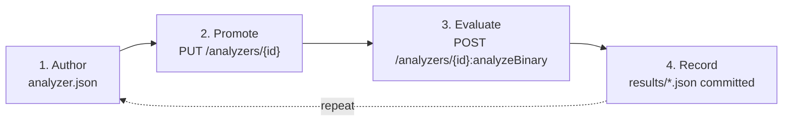
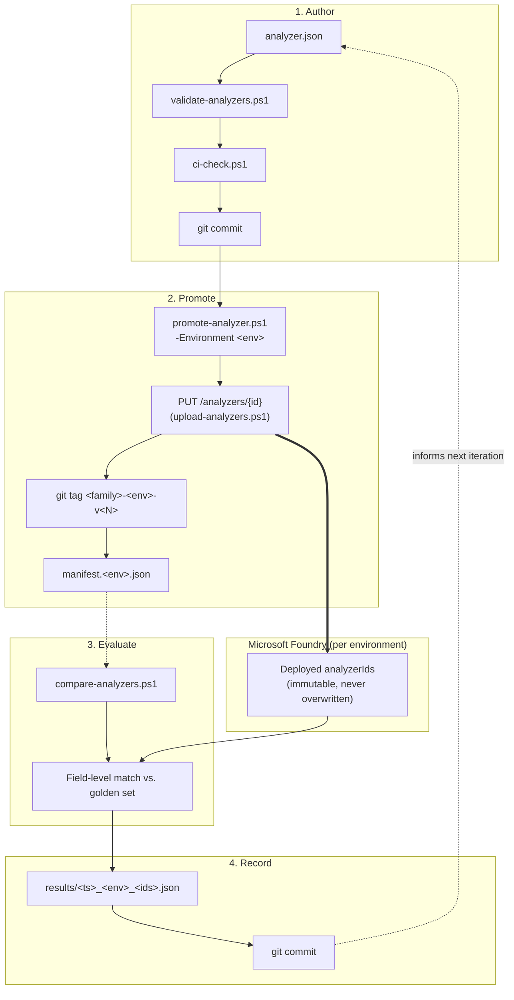
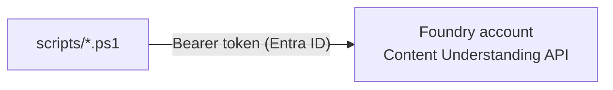

# content-understanding-mlops

Version-controlled deployment pipeline for Azure AI Content Understanding analyzers. Analyzer
definitions are stored as JSON in this repository; `scripts/*.ps1` deploy them to Microsoft
Foundry resources via the Content Understanding REST API and record every deployment as a git
tag + manifest entry.

**Source of truth model:** `analyzer.json` (per family, per repo) is authoritative. Each
Foundry account (`environments.json` entry) is a deployment target, not a source. State is
reconciled one direction only: git → Azure, via `promote-analyzer.ps1`.

---

## Authoring model: Studio (dev) vs. this repo (dev+)

| | Foundry Studio | This repo |
|---|---|---|
| Scope | `dev` environment only | All environments, including `dev` |
| Persistence | Azure-side analyzer state only; no diff/history | Full git history per commit |
| Repeatable evaluation | None | `compare-analyzers.ps1` against a fixed golden set |
| Output artifact | Analyzer JSON (pulled via `sync-analyzer-from-studio.ps1`) | Same JSON, committed as `analyzers/<family>/analyzer.json` |

Studio is the recommended tool for interactively designing `fieldSchema` and building labeled
training sets (`knowledgeSources[].kind == "labeledData"`) against the `dev` Foundry account —
and you can keep iterating in Studio for as long as you like, not just once. When ready to
commit the current state:

1. Run `sync-analyzer-from-studio.ps1 -Environment dev -Family <family> -AnalyzerId <id>` to
   pull the live definition down into `analyzers/<family>/analyzer.json` (strips Studio/API-only
   metadata; restricted to `dev`).
2. Review the diff, fix golden-set drift if `fieldSchema` changed, and commit.
3. Run `promote-analyzer.ps1 -Environment dev` as usual — this is what actually creates the
   next official, git-tagged `analyzerId`. `test`, `prod`, etc. are reached exclusively via
   `promote-analyzer.ps1`; there is no Studio access path to those environments in this model.

If the analyzer references labeled training data, see
[Labeled data across environments](docs/mlops-pipeline.md#labeled-data-across-environments) —
the data itself (blob storage) has to be copied per environment; `analyzer.json` alone doesn't
carry it.

---

## Reference documentation

| Doc | Scope |
|---|---|
| [`docs/getting-started.md`](docs/getting-started.md) | Step-by-step: prerequisites, first analyzer, first promotion, first evaluation |
| [`docs/mlops-pipeline.md`](docs/mlops-pipeline.md) | Pipeline stages, versioning model, environment promotion, labeled-data handling |
| [`docs/azure-foundry-architecture.md`](docs/azure-foundry-architecture.md) | REST operations used, auth flow, Azure resource scope |
| [`analyzers/README.md`](analyzers/README.md) | Per-family folder layout and generated index |
| [`schemas/README.md`](schemas/README.md) | `analyzer.json` / golden-set schema validation |

---

## Pipeline stages



| Stage | Operation | Script |
|---|---|---|
| 1. Author | Edit `analyzer.json`; validated against `schemas/analyzer.schema.json` | *(edit + `ci-check.ps1` + commit)* |
| 2. Promote | Deploys as a new immutable `analyzerId` in one target environment; tags the commit | `promote-analyzer.ps1` |
| 3. Evaluate | Runs the golden PDF set through one or more live `analyzerId`s via `analyzeBinary`; scores field-level accuracy | `compare-analyzers.ps1` |
| 4. Record | Persists the scored comparison as JSON under `analyzers/<family>/results/` | *(automatic, part of stage 3)* |

Full mechanics: [`docs/mlops-pipeline.md`](docs/mlops-pipeline.md).

<details>
<summary>Detailed data-flow diagram</summary>



</details>

---

## Azure surface area

Only the Content Understanding data-plane API is used: `PUT /analyzers/{id}` (create) and
`POST /analyzers/{id}:analyzeBinary` (extract). Auth is Microsoft Entra ID token-based
(`disableLocalAuth: true`; no subscription keys). Full detail:
[`docs/azure-foundry-architecture.md`](docs/azure-foundry-architecture.md).



---

## Environments

Each named environment in [`environments.json`](environments.json) maps to a distinct Foundry
account (`endpoint`) and, optionally, a distinct labeled-data blob container
(`labeledDataContainerUrl`). Environments do not share deployed `analyzerId`s, manifests, or
labeled data — each is independently promoted to.

A git branch merge changes tracked files only; it never invokes the Azure API. Promoting to an
environment is always an explicit, separate step:

```powershell
pwsh -File .\scripts\promote-analyzer.ps1 -Environment dev  -Family <family> -Notes "..."
pwsh -File .\scripts\promote-analyzer.ps1 -Environment test -Family <family> -Notes "..."
```

Beyond `dev`, promotion is the only supported path to any environment — there is no Studio
equivalent for `test`/`prod`/etc.

---

## Repository layout

| Path | Contents |
|---|---|
| `analyzers/<family>/` | `analyzer.json`, per-environment `manifest.<env>.json`, `golden/` test set, `results/` |
| `schemas/` | JSON Schemas + validation/generation scripts |
| `scripts/` | `new-analyzer.ps1`, `promote-analyzer.ps1`, `compare-analyzers.ps1`, `upload-analyzers.ps1`, `list-analyzers.ps1`, `copy-labeled-data.ps1`, `ci-check.ps1` |
| `docs/` | Reference documentation |
| `environments.json` | Environment name → `{ endpoint, labeledDataContainerUrl }` |

---

## Command reference

```powershell
# Run all validation checks (schema, golden-set integrity, family index freshness)
pwsh -File .\scripts\ci-check.ps1

# Scaffold a new analyzer family from analyzers/_template, placeholders pre-filled
pwsh -File .\scripts\new-analyzer.ps1 -Family <family> -Description "..."

# Pull a live analyzer's current definition from Studio (dev only) into analyzer.json
pwsh -File .\scripts\sync-analyzer-from-studio.ps1 -Environment dev -Family <family> -AnalyzerId <id>

# Deploy analyzer.json as a new analyzerId in one environment; tags the commit; updates manifest.<env>.json
pwsh -File .\scripts\promote-analyzer.ps1 -Environment dev -Family <family> -Notes "..."

# Run the golden PDF set through one or more analyzerIds; prints + saves per-field accuracy
pwsh -File .\scripts\compare-analyzers.ps1 -Environment dev -Family <family> -AnalyzerIds <idA>, <idB>

# Draft expected.json files from a deployed analyzerId's own output, for review
pwsh -File .\scripts\bootstrap-golden.ps1 -Environment dev -Family <family> -AnalyzerId <id>

# List analyzers deployed in an environment (useful to check what's live, or find a forgotten analyzerId)
pwsh -File .\scripts\list-analyzers.ps1 -Environment dev

# Copy labeled-data blobs from one environment's storage container to another's (same prefix)
pwsh -File .\scripts\copy-labeled-data.ps1 -SourceEnvironment dev -DestinationEnvironment test -Prefix "labelingProjects/<id>/train"
```

> Requires PowerShell 7+ (`pwsh`). `Invoke-WebRequest` throws under Windows PowerShell 5.1.
