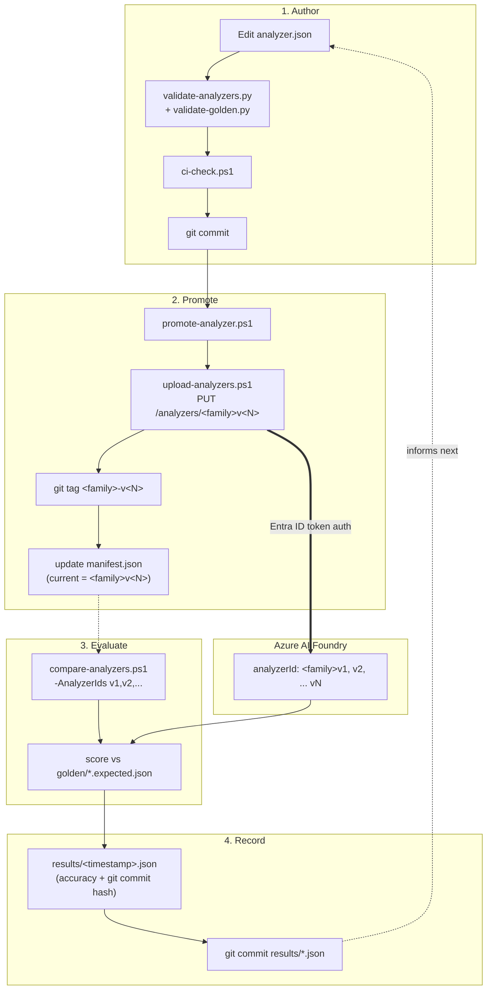
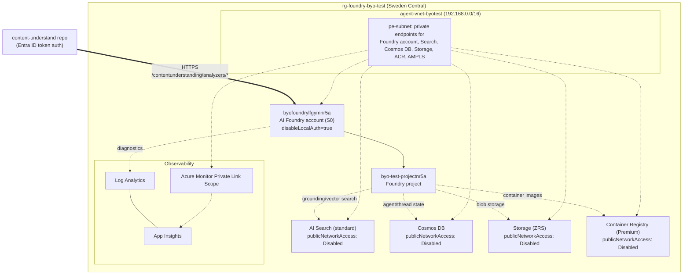

# content-understand

A version-controlled, MLOps-oriented workflow for Azure AI Content Understanding analyzers.

## Start here

- **[`docs/mlops-pipeline.md`](docs/mlops-pipeline.md)** — how this repo's author → promote →
  evaluate → record pipeline works, with a full diagram.
- **[`docs/azure-foundry-architecture.md`](docs/azure-foundry-architecture.md)** — the Azure AI
  Foundry infrastructure these analyzers are deployed against, with a full diagram.
- **[`analyzers/README.md`](analyzers/README.md)** — index of every analyzer family (what it
  extracts, what's currently deployed, golden test coverage).
- **[`schemas/README.md`](schemas/README.md)** — how `analyzer.json` files are validated and
  where the schema comes from.

## Pipeline: author → promote → evaluate → record

`analyzer.json` is edited and committed like normal source code (git = version history).
Promotion deploys its current contents to Azure under a new immutable `analyzerId`, tags the
commit in git, and updates a per-family `manifest.json` pointing at what's currently live.
Evaluation runs the golden test set through one or more live versions and diffs the results;
every comparison is saved as a git-tracked JSON report so accuracy is trackable over time.
Full details: [`docs/mlops-pipeline.md`](docs/mlops-pipeline.md).



## Azure infrastructure

Analyzers are deployed against a private ("bring your own network") Azure AI Foundry account
(`byofoundrylfgymnr5a` in `rg-foundry-byo-test`), with AI Search, Cosmos DB, Storage, and ACR all
behind private endpoints. Full inventory + diagram: [`docs/azure-foundry-architecture.md`](docs/azure-foundry-architecture.md).



## Layout

```
analyzers/<family>/   # one folder per analyzer (definition, promotion log, test data, results)
schemas/              # JSON Schemas + validation/generation tooling
scripts/              # PowerShell tooling: upload, promote, compare, CI check
docs/                 # architecture + pipeline documentation
```

## Common commands

```powershell
# Validate everything before committing/promoting
pwsh -File .\scripts\ci-check.ps1

# Promote a family's analyzer.json to a new versioned Azure deployment
pwsh -File .\scripts\promote-analyzer.ps1 -Endpoint <endpoint> -Family <family> -Notes "..."

# Compare two live versions against the golden set (saves a git-tracked report)
pwsh -File .\scripts\compare-analyzers.ps1 -Endpoint <endpoint> -Family <family> -AnalyzerIds <idA>, <idB>
```

> **Note**: scripts require PowerShell 7+ (`pwsh`). Windows PowerShell 5.1 (`powershell.exe`)
> throws a null-reference error in `Invoke-WebRequest` with these scripts.

