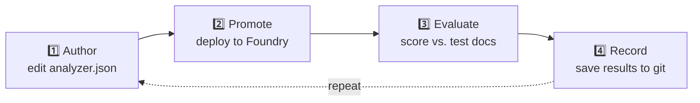
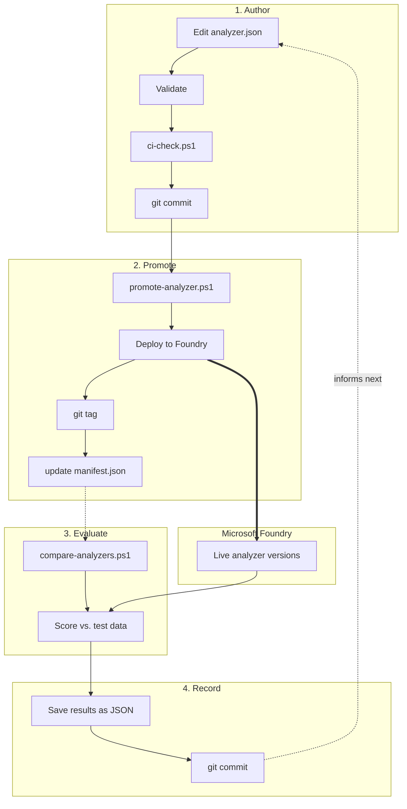
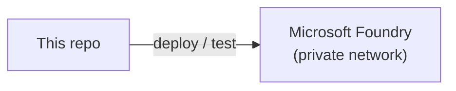

# ContentUnderstandingOps

A simple, version-controlled way to manage Microsoft Foundry Content Understanding analyzers.

Think of it like this: **git is where analyzers are designed and tested. Azure is where they run.**

---

## 🎯 The one rule to remember

| | Use for | Treat as |
|---|---|---|
| **Foundry Studio** | Quick dev/POC experiments | Throwaway — never "the real thing" |
| **This repo** | Anything real | The source of truth |

Once an idea works in Studio, copy it into `analyzer.json`, commit it, and deploy it with a
script. After that, **only this repo should touch that analyzer** — not Studio.

**Why?** Studio has no version history and no tests. If someone edits a live analyzer in
Studio, git and Azure quietly go out of sync — and nobody would notice.

---

## 📖 Read next

| Doc | What it covers |
|---|---|
| [`docs/mlops-pipeline.md`](docs/mlops-pipeline.md) | How the 4-step pipeline works |
| [`docs/azure-foundry-architecture.md`](docs/azure-foundry-architecture.md) | The Azure setup analyzers run on |
| [`analyzers/README.md`](analyzers/README.md) | List of analyzers and their status |
| [`schemas/README.md`](schemas/README.md) | How `analyzer.json` gets validated |

---

## 🔄 The 4-step pipeline



| Step | What happens | Command |
|---|---|---|
| 1️⃣ **Author** | Edit `analyzer.json` like normal code | *(just edit + commit)* |
| 2️⃣ **Promote** | Deploy it to Foundry as a new version | `promote-analyzer.ps1` |
| 3️⃣ **Evaluate** | Test it against known-correct answers | `compare-analyzers.ps1` |
| 4️⃣ **Record** | Save the score as a file in git | *(done automatically)* |

Full details: [`docs/mlops-pipeline.md`](docs/mlops-pipeline.md).

<details>
<summary>Show detailed pipeline diagram</summary>



</details>

---

## ☁️ The Azure setup (short version)

Analyzers run on a private Microsoft Foundry account. Only the Content Understanding API is
used by this pipeline — nothing else needs to be touched.



Full inventory + diagram: [`docs/azure-foundry-architecture.md`](docs/azure-foundry-architecture.md).

---

## 📁 Folder guide

| Folder | Contains |
|---|---|
| `analyzers/<family>/` | One analyzer's definition, deployment history, test data, results |
| `schemas/` | Validation rules + tooling |
| `scripts/` | The PowerShell tools: upload, promote, compare, CI check |
| `docs/` | This documentation |

---

## ⚡ Quick commands

```powershell
# ✅ Check everything is valid before committing
pwsh -File .\scripts\ci-check.ps1

# 🚀 Deploy an analyzer.json as a new version
pwsh -File .\scripts\promote-analyzer.ps1 -Endpoint <endpoint> -Family <family> -Notes "..."

# 📊 Compare two versions against test documents
pwsh -File .\scripts\compare-analyzers.ps1 -Endpoint <endpoint> -Family <family> -AnalyzerIds <idA>, <idB>
```

> ⚠️ **Requires PowerShell 7 (`pwsh`), not Windows PowerShell 5.1** — the older version errors
> out on these scripts.
