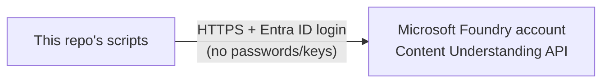
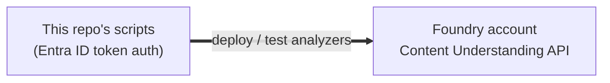

# Azure Setup: Microsoft Foundry

Where analyzers actually run, and what's around them.

---

## Quick summary

Analyzers deploy to a **private Microsoft Foundry account** — no public internet access, all
traffic stays inside a private network. Only one part of it matters for this repo: the
**Content Understanding API**.

> **Studio note**: Foundry Studio (the web UI) is for dev/POC experiments only. It's not
> part of this repo's deployment pipeline — see [`mlops-pipeline.md`](./mlops-pipeline.md).

---

## What we actually use

This repo only ever talks to **one thing**: the Foundry account's Content Understanding API.
Specifically, the scripts call two REST operations on it:
- `PUT .../analyzers/{analyzerId}` — creates a new analyzer from `analyzer.json`
  (used by `promote-analyzer.ps1` / `upload-analyzers.ps1`).
- `POST .../analyzers/{analyzerId}:analyzeBinary` — submits a document (a PDF) and starts
  extraction; the result is fetched by polling an `Operation-Location` URL Azure returns until
  it reports `Succeeded` (used by `compare-analyzers.ps1`).

The account may have other Azure resources sitting next to it (networking, logging, etc.) but
none of that matters here — the scripts don't touch it.

---

## Security basics

- **No passwords or API keys** — everything uses Microsoft Entra ID login tokens
  (`disableLocalAuth: true` on the Foundry account, so key-based auth is switched off entirely).
- Every script authenticates the same way: it runs
  `az account get-access-token --resource https://cognitiveservices.azure.com` to get a
  short-lived token for the currently logged-in Azure CLI user, and sends it as a normal
  `Authorization: Bearer <token>` header on each request. There's no secret stored anywhere in
  this repo.

---

## Environments

There's currently just **one** registered Foundry account (`dev` in
[`environments.json`](../environments.json)). Add a new entry there (name + endpoint) for each
additional environment (`test`, `prod`, ...) as more Foundry accounts get provisioned — each
is fully independent, with its own analyzers and its own `manifest.<env>.json` per family. See
[`mlops-pipeline.md`](./mlops-pipeline.md#-multiple-environments-devtestprod) for how promotion
works across environments.

---

Show technical diagram

