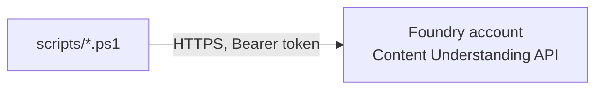

# Azure Setup: Microsoft Foundry

Technical reference for the Azure surface area this repository interacts with.

---

## Scope

The pipeline targets the Content Understanding data-plane API on a Microsoft Foundry account.
No other Azure resource type is called by the analyzer-management scripts in this repo.

Four REST operations are used, all under `{endpoint}/contentunderstanding`, api-version
`2025-11-01` (GA):

| Operation | Method + path | Used by | Purpose |
|---|---|---|---|
| Create analyzer | `PUT /analyzers/{analyzerId}?api-version=2025-11-01&allowReplace=true` | `upload-analyzers.ps1` (via `promote-analyzer.ps1`) | Creates a new analyzer from an `analyzer.json` body; returns `Operation-Location` for polling |
| Get analyzer | `GET /analyzers/{analyzerId}?api-version=2025-11-01` | `sync-analyzer-from-studio.ps1` | Read-only fetch of a live (Studio-edited) analyzer's current definition, for pulling into `analyzer.json` |
| List analyzers | `GET /analyzers?api-version=2025-11-01` | `list-analyzers.ps1` | Read-only, paginated listing of every analyzer deployed in an environment (custom and/or prebuilt) |
| Analyze document | `POST /analyzers/{analyzerId}:analyzeBinary?api-version=2025-11-01` | `compare-analyzers.ps1`, `bootstrap-golden.ps1` | Submits document bytes for extraction; returns `Operation-Location` for polling |

Create and Analyze are asynchronous: the initial response returns `202 Accepted` with an
`Operation-Location` header; the caller polls `GET {Operation-Location}` until
`status ∈ {"Succeeded", "Failed"}`. Get analyzer and List analyzers are synchronous,
single-request reads (List follows `nextLink` for pagination).



> Foundry Studio (the web UI) is used for ongoing `dev`-scoped authoring — see
> [`mlops-pipeline.md`](./mlops-pipeline.md#authoring-studio-dev-vs-this-repo-dev) for the
> workflow boundary and how Studio edits get pulled back into git.

---

## Authentication

`disableLocalAuth: true` is set on the Foundry account — subscription-key auth
(`Ocp-Apim-Subscription-Key`) is rejected entirely. All requests use Microsoft Entra ID
bearer tokens.

Token acquisition (identical in every script):
```powershell
az account get-access-token --resource https://cognitiveservices.azure.com --query accessToken -o tsv
```
This returns a short-lived (typically ~1 hour) access token scoped to the Cognitive Services
resource provider, for whichever principal is currently logged in via `az login` (interactive
user or service principal, if run non-interactively via `az login --service-principal`). The
token is sent as `Authorization: Bearer <token>` on every request. No token or key is persisted
to disk or committed to this repository.

RBAC requirement: the calling principal needs a role granting
`Microsoft.CognitiveServices/accounts/*` data-plane access on the target Foundry account (e.g.
`Cognitive Services User` or a custom role with equivalent `analyzers` permissions).

---

## Environments

Repo-root `environments.json` maps environment names to Foundry accounts:

```json
{
  "environments": {
    "<name>": {
      "endpoint": "https://<resource>.cognitiveservices.azure.com",
      "labeledDataContainerUrl": "https://<storage-account>.blob.core.windows.net/<container>"
    }
  }
}
```

Each environment corresponds to a physically distinct Foundry account (own subscription,
resource group, or region as appropriate) — analyzers, manifests, and labeled-data storage are
not shared across entries. See
[`mlops-pipeline.md`](./mlops-pipeline.md#environments) for the promotion model across
environments and [`mlops-pipeline.md`](./mlops-pipeline.md#labeled-data-across-environments)
for how labeled training data is replicated between them.

If one analyzer family needs different settings (for example a different
`labeledDataContainerUrl`), add `analyzers/<family>/environments.json`; scripts that operate on a
family merge those values over the repo-root defaults for that family only.

---

## Out of scope

The Foundry account may sit alongside other Azure resources (networking, Log Analytics,
associated AI Search/Cosmos/Storage/Container Registry resources typical of a Foundry
deployment) depending on how the account was provisioned. None of these are read, written, or
otherwise referenced by any script in this repo, with one exception: the storage account
referenced by `labeledDataContainerUrl`, accessed directly via `azcopy` in
`copy-labeled-data.ps1` (see [`mlops-pipeline.md`](./mlops-pipeline.md#labeled-data-across-environments)).
