# Azure Architecture: rg-foundry-byo-test

**Subscription**: MCAPS-Hybrid-REQ-159243-2026-ollisgeorge (`aa5b62ac-f23e-4b09-b0e0-ef1a1e58dbcc`)
**Region**: Sweden Central
**Resource Group**: `rg-foundry-byo-test`
**Generated**: 2026-08-21

## Overview

This resource group hosts a private ("bring your own network") Azure AI Foundry deployment
that the `content-understand` repository's analyzers are deployed against. The Foundry
account (`byofoundrylfgymnr5a`, kind `AIServices`) exposes the Content Understanding data-plane
API (`https://byofoundrylfgymnr5a.cognitiveservices.azure.com`) that `scripts/upload-analyzers.ps1`,
`scripts/promote-analyzer.ps1`, and `scripts/compare-analyzers.ps1` call directly.

Every dependent data service — Azure AI Search, Cosmos DB, and Blob Storage (used by the Foundry
project for grounding data, vector indexes, and agent/thread storage) — sits behind private
endpoints inside `agent-vnet-byotest`, with `publicNetworkAccess` disabled. DNS resolution for
each private endpoint is handled by a matching Azure Private DNS zone linked to the VNet. A
single Foundry **project** (`byo-test-projectnr5a`) is provisioned under the account. Observability
(Log Analytics + Application Insights) is centralized via an Azure Monitor Private Link Scope
(AMPLS) so telemetry also stays off the public internet. An Azure Container Registry (Premium,
private) is available for any custom container images the project's agents might need.

Authentication to the Foundry/Content Understanding account is Microsoft Entra ID only
(`disableLocalAuth: true` — no subscription keys), which is why every script in this repo
acquires a token via `az account get-access-token --resource https://cognitiveservices.azure.com`.

## Resource Inventory

| Resource Name | Type | Tier/SKU | Location | Notes |
|---|---|---|---|---|
| `byofoundrylfgymnr5a` | Cognitive Services / AI Foundry account (kind `AIServices`) | S0 | Sweden Central | Content Understanding + OpenAI data-plane; `disableLocalAuth=true`; custom sub-domain `byofoundrylfgymnr5a` |
| `byofoundrylfgymnr5a/byo-test-projectnr5a` | AI Foundry project (child resource) | — | Sweden Central | Project used for agents/threads on top of the account |
| `byofoundrylfgymnr5asearch` | Azure AI Search | standard, 1 replica / 1 partition | Sweden Central | `publicNetworkAccess: Disabled`; grounding/vector index for Foundry |
| `byofoundrylfgymnr5acosmosdb` | Azure Cosmos DB (GlobalDocumentDB) | Session consistency | Sweden Central | `publicNetworkAccess: Disabled`; agent/thread state store |
| `byofoundrylfgymnr5ast` | Storage Account (StorageV2) | Standard_ZRS | Sweden Central | `publicNetworkAccess: Disabled`; blob storage for Foundry project |
| `acrnr5a` | Azure Container Registry | Premium | Sweden Central | `publicNetworkAccess: Disabled`; admin user disabled |
| `agent-vnet-byotest` | Virtual Network | `192.168.0.0/16` | Sweden Central | Subnets: `agent-subnet` (`192.168.0.0/24`), `pe-subnet` (`192.168.1.0/24`) |
| `law-tracing-nr5a` | Log Analytics Workspace | PerGB2018, 30-day retention | Sweden Central | Central log sink |
| `appi-tracing-nr5a` | Application Insights | — | Sweden Central | Linked to `law-tracing-nr5a` |
| `ampls-tracing-nr5a` | Azure Monitor Private Link Scope | — | Global | Keeps telemetry ingestion private |
| 6x Private Endpoints | Private Endpoint | — | Sweden Central | One each for the AI Foundry account, Search, Cosmos DB, Storage (blob), ACR, and AMPLS |
| 6x Private DNS Zones | Private DNS Zone | — | Global | `privatelink.cognitiveservices.azure.com`, `privatelink.openai.azure.com`, `privatelink.services.ai.azure.com`, `privatelink.search.windows.net`, `privatelink.documents.azure.com`, `privatelink.blob.core.windows.net`, `privatelink.azurecr.io`, plus AMPLS-related zones — all linked to `agent-vnet-byotest` |
| 2x Network Security Groups | NSG | — | Sweden Central | Attached to `agent-subnet` and `pe-subnet` |

## Architecture Diagram

```mermaid
graph TB
    subgraph EXT["External"]
        DEV["content-understand repo<br/>promote-analyzer.ps1 / compare-analyzers.ps1<br/>(Entra ID token auth)"]
    end

    subgraph RG["Resource Group: rg-foundry-byo-test (Sweden Central)"]

        subgraph VNET["VNet: agent-vnet-byotest (192.168.0.0/16)"]
            subgraph AGENTSUBNET["agent-subnet (192.168.0.0/24)<br/>NSG attached"]
            end
            subgraph PESUBNET["pe-subnet (192.168.1.0/24)<br/>NSG attached"]
                PE_ACCOUNT["PE: byofoundrylfgymnr5a<br/>group: account"]
                PE_SEARCH["PE: byofoundrylfgymnr5asearch<br/>group: searchService"]
                PE_COSMOS["PE: byofoundrylfgymnr5acosmosdb<br/>group: Sql"]
                PE_STORAGE["PE: byofoundrylfgymnr5ast<br/>group: blob"]
                PE_ACR["PE: acrnr5a<br/>group: registry"]
                PE_AMPLS["PE: ampls-tracing-nr5a<br/>group: azuremonitor"]
            end
        end

        subgraph DNS["Private DNS Zones (linked to VNet)"]
            DNS_COG["privatelink.cognitiveservices.azure.com"]
            DNS_OAI["privatelink.openai.azure.com"]
            DNS_AI["privatelink.services.ai.azure.com"]
            DNS_SEARCH["privatelink.search.windows.net"]
            DNS_COSMOS["privatelink.documents.azure.com"]
            DNS_BLOB["privatelink.blob.core.windows.net"]
            DNS_ACR["privatelink.azurecr.io"]
            DNS_MON["privatelink.monitor.azure.com<br/>+ oms/ods/agentsvc zones"]
        end

        FOUNDRY["byofoundrylfgymnr5a<br/>AI Foundry account (kind: AIServices)<br/>SKU S0 | disableLocalAuth=true<br/>Content Understanding + OpenAI data-plane"]
        PROJECT["byo-test-projectnr5a<br/>AI Foundry project"]
        SEARCH["byofoundrylfgymnr5asearch<br/>Azure AI Search (standard)<br/>publicNetworkAccess: Disabled"]
        COSMOS["byofoundrylfgymnr5acosmosdb<br/>Cosmos DB (Session consistency)<br/>publicNetworkAccess: Disabled"]
        STORAGE["byofoundrylfgymnr5ast<br/>Storage (StorageV2, ZRS)<br/>publicNetworkAccess: Disabled"]
        ACR["acrnr5a<br/>Container Registry (Premium)<br/>publicNetworkAccess: Disabled"]

        subgraph MON["Observability"]
            LAW["law-tracing-nr5a<br/>Log Analytics (PerGB2018, 30d)"]
            APPI["appi-tracing-nr5a<br/>Application Insights"]
            AMPLS["ampls-tracing-nr5a<br/>Azure Monitor Private Link Scope"]
        end
    end

    DEV ==>|"HTTPS + Entra ID token<br/>PUT/GET/POST /contentunderstanding/analyzers/*"| FOUNDRY
    FOUNDRY --> PROJECT
    PROJECT -.->|"grounding / vector search"| SEARCH
    PROJECT -.->|"agent & thread state"| COSMOS
    PROJECT -.->|"blob storage"| STORAGE
    PROJECT -.->|"custom container images"| ACR

    PE_ACCOUNT -.-> FOUNDRY
    PE_SEARCH -.-> SEARCH
    PE_COSMOS -.-> COSMOS
    PE_STORAGE -.-> STORAGE
    PE_ACR -.-> ACR
    PE_AMPLS -.-> AMPLS

    PESUBNET --> DNS
    DNS_COG -.-> PE_ACCOUNT
    DNS_OAI -.-> PE_ACCOUNT
    DNS_AI -.-> PE_ACCOUNT
    DNS_SEARCH -.-> PE_SEARCH
    DNS_COSMOS -.-> PE_COSMOS
    DNS_BLOB -.-> PE_STORAGE
    DNS_ACR -.-> PE_ACR
    DNS_MON -.-> PE_AMPLS

    APPI --> LAW
    AMPLS -.->|"private telemetry ingestion"| APPI
    FOUNDRY -.->|"diagnostic logs"| LAW
```

## Relationship Details

### Network Architecture

`agent-vnet-byotest` (`192.168.0.0/16`) has two subnets: `agent-subnet` (reserved for
agent/compute workloads) and `pe-subnet`, which hosts every private endpoint in the resource
group. Both subnets have their own NSG. All six private endpoints (`account` on the Foundry
resource, `searchService`, `Sql`, `blob`, `registry`, and `azuremonitor`) resolve via matching
Private DNS Zones linked to this VNet, so name resolution for
`*.cognitiveservices.azure.com`, `*.openai.azure.com`, `*.services.ai.azure.com`,
`*.search.windows.net`, `*.documents.azure.com`, `*.blob.core.windows.net`, and
`*.azurecr.io` stays inside the VNet rather than hitting public DNS.

### Data Flow

The Foundry account (`byofoundrylfgymnr5a`) is the single entry point for both this repo's
Content Understanding calls and the Foundry project's own model/agent traffic. The project
(`byo-test-projectnr5a`) uses AI Search for grounding/vector search, Cosmos DB for agent/thread
persistence, and Blob Storage for file/document storage; ACR is available if the project needs
custom container images. None of Search, Cosmos DB, Storage, or ACR are reachable from the
public internet — `publicNetworkAccess` is `Disabled` on all four.

### Identity & Access

The Foundry account has `disableLocalAuth: true`, so there are no subscription keys — every
caller (this repo's PowerShell scripts included) must authenticate with a Microsoft Entra ID
access token scoped to `https://cognitiveservices.azure.com`. RBAC role assignments (not shown
here) govern which principals can call the data-plane APIs.

### Dependencies

`agent-vnet-byotest` and its subnets/NSGs must exist before the private endpoints; each private
endpoint depends on its target resource being deployed first; and each Private DNS Zone must be
linked to the VNet for name resolution to work end-to-end. The Foundry account must exist
before the `byo-test-projectnr5a` project can be created under it.

## Notes & Recommendations

- Interestingly, the Foundry account itself reports `publicNetworkAccess: Enabled` at the
  account level even though a private endpoint also exists for it — worth confirming whether
  public access should be explicitly disabled to match the rest of the private-only resources
  in this group (Search, Cosmos DB, Storage, ACR all have `publicNetworkAccess: Disabled`).
- This resource group currently has **no per-environment split** (dev/test/prod) — it's a single
  shared instance. If/when multiple environments are introduced for the `content-understand`
  analyzer pipeline, expect a parallel resource group (e.g. `rg-foundry-byo-<env>`) per
  environment, each with its own Foundry account endpoint for `promote-analyzer.ps1` to target.
- No public ingress path exists for the Content Understanding API other than the account's
  current public endpoint — access is via Entra ID auth only, so network exposure risk is low
  even with `publicNetworkAccess: Enabled`.
