# Azure Architecture: Microsoft Foundry (private/BYO-VNet deployment)

**Region**: *(your Azure region)*
**Resource Group**: *(your resource group)*
**Generated**: 2026-08-21

## Studio note

Foundry Studio (the web UI for this account) is great for **dev/POC exploration** — quickly
trying a field or prompt idea. It's not used as part of this repo's deployment pipeline, and
anything created there should be considered experimental until it's copied into `analyzer.json`
and promoted through git (see [`mlops-pipeline.md`](./mlops-pipeline.md)).

## Overview

This describes a private ("bring your own network") Microsoft Foundry deployment that the
`content-understand` repository's analyzers are deployed against. The Foundry account (kind
`AIServices`) exposes the Content Understanding data-plane API
(`https://<your-resource>.cognitiveservices.azure.com`) that `scripts/upload-analyzers.ps1`,
`scripts/promote-analyzer.ps1`, and `scripts/compare-analyzers.ps1` call directly.

Every dependent data service — Azure AI Search, Cosmos DB, and Blob Storage (used by the Foundry
project for grounding data, vector indexes, and agent/thread storage) — sits behind private
endpoints inside the project's VNet, with `publicNetworkAccess` disabled. DNS resolution for
each private endpoint is handled by a matching Azure Private DNS zone linked to the VNet. A
single Foundry **project** is provisioned under the account. Observability (Log Analytics +
Application Insights) is centralized via an Azure Monitor Private Link Scope (AMPLS) so
telemetry also stays off the public internet. An Azure Container Registry (Premium, private) is
available for any custom container images the project's agents might need.

**Note**: Azure AI Search, Cosmos DB, and Container Registry are standard Microsoft Foundry
project scaffolding (used for agent threads, grounding/vector search, and custom container
images) — they are **not** directly called by this repo's analyzer pipeline. The pipeline only
talks to the Content Understanding API on the Foundry account itself.

Authentication to the Foundry/Content Understanding account is Microsoft Entra ID only
(`disableLocalAuth: true` — no subscription keys), which is why every script in this repo
acquires a token via `az account get-access-token --resource https://cognitiveservices.azure.com`.

## Resource Inventory

| Resource | Type | Tier/SKU | Notes |
|---|---|---|---|
| Foundry account | Cognitive Services / Foundry account (kind `AIServices`) | S0 | Content Understanding + OpenAI data-plane; `disableLocalAuth=true` |
| Foundry project | Foundry project (child resource) | — | Project used for agents/threads on top of the account |
| Azure AI Search | Azure AI Search | standard, 1 replica / 1 partition | `publicNetworkAccess: Disabled`; grounding/vector index for the Foundry project (unused by this repo's pipeline) |
| Cosmos DB | Azure Cosmos DB (GlobalDocumentDB) | Session consistency | `publicNetworkAccess: Disabled`; agent/thread state store (unused by this repo's pipeline) |
| Storage Account | Storage Account (StorageV2) | Standard_ZRS | `publicNetworkAccess: Disabled`; blob storage for the Foundry project |
| Container Registry | Azure Container Registry | Premium | `publicNetworkAccess: Disabled`; admin user disabled (unused by this repo's pipeline) |
| Virtual Network | Virtual Network | — | Subnets: an agent/compute subnet and a private-endpoint subnet |
| Log Analytics Workspace | Log Analytics Workspace | PerGB2018, 30-day retention | Central log sink |
| Application Insights | Application Insights | — | Linked to the Log Analytics workspace |
| Azure Monitor Private Link Scope | AMPLS | — | Keeps telemetry ingestion private |
| Private Endpoints | Private Endpoint (x6) | — | One each for the Foundry account, Search, Cosmos DB, Storage (blob), Container Registry, and AMPLS |
| Private DNS Zones | Private DNS Zone (x6+) | — | `privatelink.cognitiveservices.azure.com`, `privatelink.openai.azure.com`, `privatelink.services.ai.azure.com`, `privatelink.search.windows.net`, `privatelink.documents.azure.com`, `privatelink.blob.core.windows.net`, `privatelink.azurecr.io`, plus AMPLS-related zones — all linked to the VNet |
| Network Security Groups | NSG (x2) | — | Attached to the agent subnet and private-endpoint subnet |

## Architecture Diagram

```mermaid
graph TB
    subgraph EXT["External"]
        DEV["content-understand repo<br/>promote-analyzer.ps1 / compare-analyzers.ps1<br/>(Entra ID token auth)"]
    end

    subgraph RG["Resource Group (private / BYO-VNet)"]

        subgraph VNET["Virtual Network"]
            subgraph AGENTSUBNET["Agent subnet<br/>NSG attached"]
            end
            subgraph PESUBNET["Private-endpoint subnet<br/>NSG attached"]
                PE_ACCOUNT["PE: Foundry account<br/>group: account"]
                PE_SEARCH["PE: AI Search<br/>group: searchService"]
                PE_COSMOS["PE: Cosmos DB<br/>group: Sql"]
                PE_STORAGE["PE: Storage<br/>group: blob"]
                PE_ACR["PE: Container Registry<br/>group: registry"]
                PE_AMPLS["PE: AMPLS<br/>group: azuremonitor"]
            end
        end

        subgraph DNS["Private DNS Zones (linked to VNet)"]
            DNS_COG["privatelink.cognitiveservices.azure.com"]
            DNS_OAI["privatelink.openai.azure.com"]
            DNS_AI["privatelink.services.ai.azure.com"]
            DNS_SEARCH["privatelink.search.windows.net"]
            DNS_COSMOS["privatelink.documents.azure.com"]
            DNS_BLOB["privatelink.blob.core.windows.net"]
            DNS_ACR["privatelink.azurecr.io"]
            DNS_MON["privatelink.monitor.azure.com<br/>+ oms/ods/agentsvc zones"]
        end

        FOUNDRY["Foundry account (kind: AIServices)<br/>SKU S0 | disableLocalAuth=true<br/>Content Understanding + OpenAI data-plane"]
        PROJECT["Foundry project"]
        SEARCH["Azure AI Search (standard)<br/>publicNetworkAccess: Disabled<br/>(unused by this pipeline)"]
        COSMOS["Cosmos DB (Session consistency)<br/>publicNetworkAccess: Disabled<br/>(unused by this pipeline)"]
        STORAGE["Storage (StorageV2, ZRS)<br/>publicNetworkAccess: Disabled"]
        ACR["Container Registry (Premium)<br/>publicNetworkAccess: Disabled<br/>(unused by this pipeline)"]

        subgraph MON["Observability"]
            LAW["Log Analytics (PerGB2018, 30d)"]
            APPI["Application Insights"]
            AMPLS["Azure Monitor Private Link Scope"]
        end
    end

    DEV ==>|"HTTPS + Entra ID token<br/>PUT/GET/POST /contentunderstanding/analyzers/*"| FOUNDRY
    FOUNDRY --> PROJECT
    PROJECT -.->|"grounding / vector search"| SEARCH
    PROJECT -.->|"agent & thread state"| COSMOS
    PROJECT -.->|"blob storage"| STORAGE
    PROJECT -.->|"custom container images"| ACR

    PE_ACCOUNT -.-> FOUNDRY
    PE_SEARCH -.-> SEARCH
    PE_COSMOS -.-> COSMOS
    PE_STORAGE -.-> STORAGE
    PE_ACR -.-> ACR
    PE_AMPLS -.-> AMPLS

    PESUBNET --> DNS
    DNS_COG -.-> PE_ACCOUNT
    DNS_OAI -.-> PE_ACCOUNT
    DNS_AI -.-> PE_ACCOUNT
    DNS_SEARCH -.-> PE_SEARCH
    DNS_COSMOS -.-> PE_COSMOS
    DNS_BLOB -.-> PE_STORAGE
    DNS_ACR -.-> PE_ACR
    DNS_MON -.-> PE_AMPLS

    APPI --> LAW
    AMPLS -.->|"private telemetry ingestion"| APPI
    FOUNDRY -.->|"diagnostic logs"| LAW
```

## Relationship Details

### Network Architecture

The VNet has two subnets: an agent subnet (reserved for agent/compute workloads) and a
private-endpoint subnet, which hosts every private endpoint in the resource group. Both subnets
have their own NSG. All six private endpoints (`account` on the Foundry resource,
`searchService`, `Sql`, `blob`, `registry`, and `azuremonitor`) resolve via matching Private DNS
Zones linked to this VNet, so name resolution for `*.cognitiveservices.azure.com`,
`*.openai.azure.com`, `*.services.ai.azure.com`, `*.search.windows.net`,
`*.documents.azure.com`, `*.blob.core.windows.net`, and `*.azurecr.io` stays inside the VNet
rather than hitting public DNS.

### Data Flow

The Foundry account is the single entry point for both this repo's Content Understanding calls
and the Foundry project's own model/agent traffic. The project uses AI Search for
grounding/vector search, Cosmos DB for agent/thread persistence, and Blob Storage for
file/document storage; ACR is available if the project needs custom container images. None of
Search, Cosmos DB, Storage, or ACR are reachable from the public internet —
`publicNetworkAccess` is `Disabled` on all four. **None of these four are used by this repo's
analyzer pipeline** — only the Content Understanding API on the Foundry account is called.

### Identity & Access

The Foundry account has `disableLocalAuth: true`, so there are no subscription keys — every
caller (this repo's PowerShell scripts included) must authenticate with a Microsoft Entra ID
access token scoped to `https://cognitiveservices.azure.com`. RBAC role assignments (not shown
here) govern which principals can call the data-plane APIs.

### Dependencies

The VNet and its subnets/NSGs must exist before the private endpoints; each private endpoint
depends on its target resource being deployed first; and each Private DNS Zone must be linked
to the VNet for name resolution to work end-to-end. The Foundry account must exist before the
project can be created under it.

## Notes & Recommendations

- Interestingly, the Foundry account itself reports `publicNetworkAccess: Enabled` at the
  account level even though a private endpoint also exists for it — worth confirming whether
  public access should be explicitly disabled to match the rest of the private-only resources
  in this group (Search, Cosmos DB, Storage, ACR all have `publicNetworkAccess: Disabled`).
- This resource group currently has **no per-environment split** (dev/test/prod) — it's a single
  shared instance. If/when multiple environments are introduced for the `content-understand`
  analyzer pipeline, expect a parallel resource group per environment, each with its own Foundry
  account endpoint for `promote-analyzer.ps1` to target.
- No public ingress path exists for the Content Understanding API other than the account's
  current public endpoint — access is via Entra ID auth only, so network exposure risk is low
  even with `publicNetworkAccess: Enabled`.
