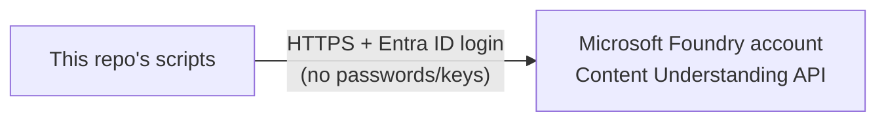
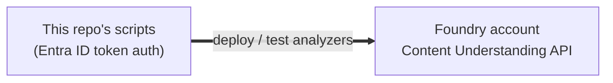

# Azure Setup: Microsoft Foundry

Where analyzers actually run, and what's around them.

---

## Quick summary

Analyzers deploy to a **private Microsoft Foundry account** — no public internet access, all
traffic stays inside a private network. Only one part of it matters for this repo: the
**Content Understanding API**.

> **Studio note**: Foundry Studio (the web UI) is for dev/POC experiments only. It's not
> part of this repo's deployment pipeline — see [`mlops-pipeline.md`](./mlops-pipeline.md).

---

## What we actually use

This repo only ever talks to **one thing**: the Foundry account's Content Understanding API.
The account may have other Azure resources sitting next to it (networking, logging, etc.) but
none of that matters here — the scripts don't touch it.

---

## Security basics

- **No passwords or API keys** — everything uses Microsoft Entra ID login tokens
  (`disableLocalAuth: true` on the Foundry account).
- Every script authenticates with
  `az account get-access-token --resource https://cognitiveservices.azure.com`.

---

## Environments

There's currently just **one** registered Foundry account (`dev` in
[`environments.json`](../environments.json)). Add a new entry there (name + endpoint) for each
additional environment (`test`, `prod`, ...) as more Foundry accounts get provisioned — each
is fully independent, with its own analyzers and its own `manifest.<env>.json` per family. See
[`mlops-pipeline.md`](./mlops-pipeline.md#-multiple-environments-devtestprod) for how promotion
works across environments.

---

Show technical diagram

