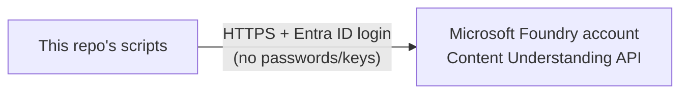
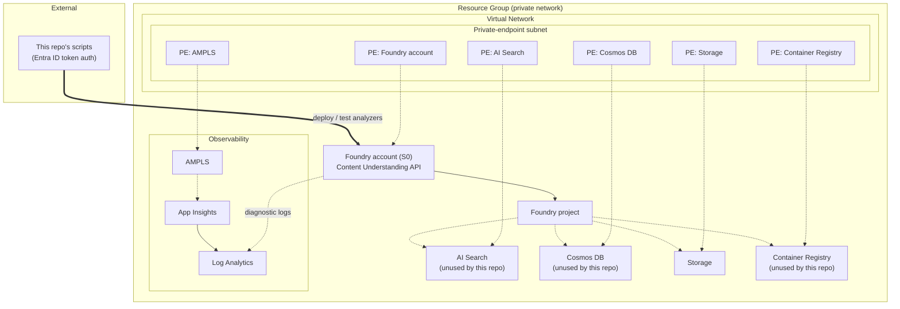

# Azure Setup: Microsoft Foundry

Where analyzers actually run, and what's around them.

---

## 🎯 Quick summary

Analyzers deploy to a **private Microsoft Foundry account** — no public internet access, all
traffic stays inside a private network. Only one part of it matters for this repo: the
**Content Understanding API**.

> ℹ️ **Studio note**: Foundry Studio (the web UI) is for dev/POC experiments only. It's not
> part of this repo's deployment pipeline — see [`mlops-pipeline.md`](./mlops-pipeline.md).

---

## 🧩 What's there, and what we actually use

| Resource | Do we use it? | Why it's there |
|---|---|---|
| **Foundry account** | ✅ Yes — this is the whole pipeline | Runs the Content Understanding API |
| **Foundry project** | ⚪ Indirectly | Groups resources under the account |
| AI Search | ❌ Not used by this repo | Comes with Foundry, used for other AI features (vector search) |
| Cosmos DB | ❌ Not used by this repo | Comes with Foundry, used for agent/chat memory |
| Storage Account | ❌ Not used by this repo | Comes with Foundry, used for file storage |
| Container Registry | ❌ Not used by this repo | Comes with Foundry, used for custom containers |
| Log Analytics + App Insights | ⚪ Background only | Collects logs/metrics — nothing to configure |

**Bottom line:** this repo only ever talks to one thing — the Foundry account's Content
Understanding API.

---

## 🔒 Security basics

- **No passwords or API keys** — everything uses Microsoft Entra ID login tokens.
- **No public internet path** — Search, Cosmos DB, Storage, and the registry are all locked
  down to a private network (`publicNetworkAccess: Disabled`).
- One thing worth double-checking: the Foundry account itself currently shows
  `publicNetworkAccess: Enabled`, even though everything else is locked down. Might be worth
  tightening to match the rest.

---

## 🌍 Environments

There's currently just **one** registered Foundry account (`dev` in
[`environments.json`](../environments.json)). Add a new entry there (name + endpoint) for each
additional environment (`test`, `prod`, ...) as more Foundry accounts get provisioned — each
is fully independent, with its own analyzers and its own `manifest.<env>.json` per family. See
[`mlops-pipeline.md`](./mlops-pipeline.md#-multiple-environments-devtestprod) for how promotion
works across environments.

---

Show full technical diagram + resource inventory

### Resource Inventory

| Resource | Type | Tier/SKU | Notes |
|---|---|---|---|
| Foundry account | Cognitive Services / Foundry account | S0 | Content Understanding + OpenAI; Entra ID auth only |
| Foundry project | Foundry project | — | Groups agents/threads under the account |
| Azure AI Search | Azure AI Search | Standard | Private only; unused by this repo |
| Cosmos DB | Cosmos DB (GlobalDocumentDB) | Session consistency | Private only; unused by this repo |
| Storage Account | Storage Account (StorageV2) | Standard_ZRS | Private only |
| Container Registry | Azure Container Registry | Premium | Private only; unused by this repo |
| Virtual Network | Virtual Network | — | Agent subnet + private-endpoint subnet |
| Log Analytics | Log Analytics Workspace | PerGB2018, 30-day retention | Central log sink |
| Application Insights | Application Insights | — | Linked to Log Analytics |
| Private Link Scope (AMPLS) | AMPLS | — | Keeps telemetry private |
| Private Endpoints | Private Endpoint (x6) | — | One per private resource above |
| Private DNS Zones | Private DNS Zone (x6+) | — | Resolves private endpoint names inside the VNet |
| Network Security Groups | NSG (x2) | — | On each subnet |

### Diagram

### Identity & access

The Foundry account has `disableLocalAuth: true` — no API keys exist. Every script in this
repo authenticates with a Microsoft Entra ID token
(`az account get-access-token --resource https://cognitiveservices.azure.com`).

