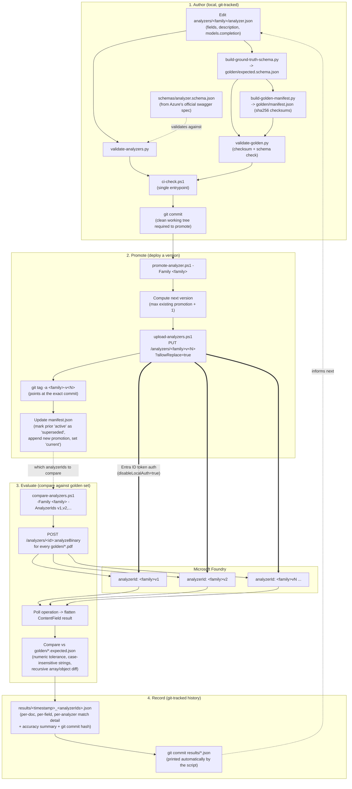

# MLOps Pipeline: Content Understanding Analyzers

**Repo**: `content-understand`
**Target resource**: your Microsoft Foundry account (see [`azure-foundry-architecture.md`](./azure-foundry-architecture.md) for the underlying Azure infrastructure)
**Generated**: 2026-08-21

## Studio vs. this repo

**Foundry Studio is for dev/POC use only.** It's the fastest way to try out a new field or
prompt idea, but it has no version history, no audit trail, and no repeatable tests — anything
built there should be treated as throwaway/experimental.

**This repo is the source of truth for anything real.** Once an idea proven in Studio is ready,
copy it into `analyzer.json`, commit it, and deploy it with `promote-analyzer.ps1`. From then on,
only this pipeline should change that analyzer — editing it again in Studio would silently
desync git and Azure with no way to detect it.

## Overview

This repo treats each Azure AI Content Understanding **analyzer family** (e.g. `invoice`,
`complaint`) as a versioned ML artifact with its own definition, test data, and deployment
history — co-located so it's always obvious which documents/forms an analyzer relates to.
Git is the single source of truth for *what changed and when*; Azure holds the *currently
deployed, queryable* analyzers; and `analyzers/<family>/manifest.json` is a derived index of
"what's live right now" so nobody has to cross-reference git tags against the Azure API to
find out.

The pipeline has four stages: **author** (edit `analyzer.json` + golden data, validated locally
and in CI), **promote** (deploy a git-tagged version to Azure under a versioned analyzer ID),
**evaluate** (run the golden test set through one or more live versions and diff results), and
**record** (save the comparison as a git-tracked JSON report so accuracy is trackable over time).

## Resource Inventory (repo tooling)

| Component | Path | Purpose |
|---|---|---|
| Analyzer definition | `analyzers/<family>/analyzer.json` | Single mutable source of truth; git history = version history |
| Promotion log | `analyzers/<family>/manifest.json` | Which git tag/commit is deployed as which Azure `analyzerId`, and which is `current` |
| Sample documents | `analyzers/<family>/sample-documents/` | Broader pool of synthetic PDFs + `.expected.json` |
| Golden set | `analyzers/<family>/golden/` | Curated PDFs + `expected.json` + checksummed `manifest.json` used for scoring |
| Comparison reports | `analyzers/<family>/results/*.json` | Git-tracked accuracy reports from every `compare-analyzers.ps1` run |
| Schema authority | `schemas/analyzer.schema.json` | JSON Schema for `analyzer.json`, extracted from Azure's official swagger spec |
| Ground-truth schema | `analyzers/<family>/golden/expected.schema.json` | Auto-derived from `analyzer.json`'s `fieldSchema`, validates `expected.json` files |
| `validate-analyzers.py` | `schemas/` | Validates `analyzer.json` against the schema |
| `validate-golden.py` | `schemas/` | Validates golden-set checksums + ground-truth schema conformance |
| `build-ground-truth-schema.py` | `schemas/` | Regenerates `expected.schema.json` from `analyzer.json` |
| `build-golden-manifest.py` | `schemas/` | Regenerates checksummed `golden/manifest.json` |
| `list-families.py` | `schemas/` | Regenerates the family index table in `analyzers/README.md` |
| `upload-analyzers.ps1` | `scripts/` | Low-level PUT of an `analyzer.json` to Azure as a named `analyzerId` |
| `promote-analyzer.ps1` | `scripts/` | Deploys the current `analyzer.json` as a new version, tags git, updates manifest |
| `compare-analyzers.ps1` | `scripts/` | Runs the golden set through one or more analyzer IDs, scores + saves results |
| `ci-check.ps1` | `scripts/` | Single CI entrypoint: schema validation + golden validation + README freshness |

## Pipeline Diagram

## Relationship Details

### Version control vs. deployment state

`analyzer.json` is edited and committed like normal source code — its history lives entirely in
git (`git log`, `git diff`, `git tag`). Azure never sees "versions" as a concept; each promotion
just deploys the file's *current* contents under a brand-new, immutable `analyzerId`
(`<family>v<N>`, lowercase — Azure rejects hyphens in analyzer IDs). `manifest.json` is a
**derived** cache of "which git tag/commit maps to which live `analyzerId`, and which one is
`current`" — it is regenerated/updated by `promote-analyzer.ps1`, never hand-edited.

### Quality feedback loop

`compare-analyzers.ps1` closes the loop: it takes whichever `analyzerIds` you pass (typically the
new version plus the previous "current" one), runs the same golden PDF set through each, and
prints/saves a side-by-side accuracy comparison. Because results are saved as git-tracked JSON
(`results/*.json`, tagged with the exact commit SHA the comparison was run against), accuracy
trends over time are diffable just like code — you can `git log -p analyzers/invoice/results/`
to see every historical run.

### CI gate

`ci-check.ps1` is the single entrypoint that should run before merging any change to
`analyzers/**`: it validates every family's `analyzer.json` against the official schema,
validates every golden set's checksums + ground-truth schema conformance, and confirms
`analyzers/README.md`'s family index table hasn't drifted out of date.

## Notes & Recommendations

- **Promotion quality gate (not yet implemented)**: `promote-analyzer.ps1` currently deploys
  unconditionally. A natural next step is to require `compare-analyzers.ps1` to run against the
  golden set as part of promotion and block if accuracy regresses beyond a threshold vs. the
  current `active` version.
- **CI automation (not yet implemented)**: `ci-check.ps1` is run manually today; wiring it into
  a GitHub Actions workflow on PRs touching `analyzers/**` would make the checks non-optional.
- **Single environment today**: all promotions currently target one Foundry account/resource.
  If/when dev/test/prod environments are introduced, expect `promote-analyzer.ps1` to take an
  `-Environment`/`-Endpoint` pair per environment, each resolving to a different Foundry account.
