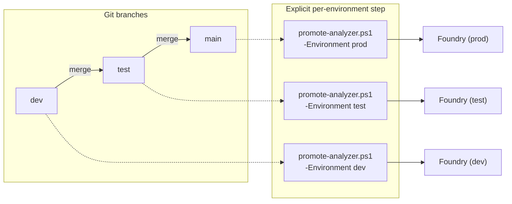
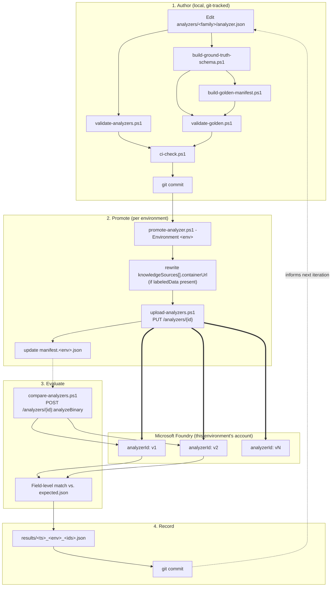

# MLOps Pipeline

Technical reference for how analyzer changes move from a git commit to a deployed, scored
Foundry analyzer, per environment.

---

## Authoring: Studio (dev) vs. this repo (dev+)

| | Foundry Studio | This repo |
|---|---|---|
| Scope | `dev` environment only | All environments |
| State tracking | None (Azure-side only) | git commit history |
| Repeatable evaluation | None | Fixed golden set, scored per `analyzerId` |
| Deployment mechanism | UI-driven, direct | `promote-analyzer.ps1` |

Studio is used to interactively construct `fieldSchema` and, where applicable, build a labeled
training set (`knowledgeSources[].kind == "labeledData"`) against the `dev` Foundry account.
Unlike a one-time export, you can keep iterating directly in Studio against `dev` for as long
as you want — there's no requirement to stop after the first import. When you're ready to
commit the current state:

1. Pull it down with
   [`sync-analyzer-from-studio.ps1`](../scripts/sync-analyzer-from-studio.ps1)
   (`GET /analyzers/{analyzerId}`, strips Studio/API-only metadata like `analyzerId`,
   `createdAt`, `status`), which overwrites `analyzers/<family>/analyzer.json`. Equivalent to
   Studio's Download action, but repeatable and scriptable.
2. Review the diff (`git diff analyzers/<family>/analyzer.json`); if `fieldSchema` changed, run
   `build-ground-truth-schema.ps1` + `sync-golden-fields.ps1` for that family (see
   [Bootstrapping and maintaining the golden set](#bootstrapping-and-maintaining-the-golden-set)).
3. Commit `analyzer.json`.
4. Run `promote-analyzer.ps1 -Environment dev` as usual. This is what actually creates the
   next official, tracked `analyzerId` — the pull step only gets the JSON out of Studio and
   into git; it never deploys anything itself. Every entry in `manifest.dev.json` still maps to
   an exact, reviewable commit, even though the analyzer was designed live in Studio.

`sync-analyzer-from-studio.ps1` refuses to run against any environment other than `dev` (pass
`-AllowNonDev` to override, which is not recommended). For any environment above `dev` (`test`,
`prod`, ...), `promote-analyzer.ps1` is the only supported mechanism — there is no Studio access
path to those environments in this model, and pulling from Studio there would make the deployed
state stop mapping to a git commit.

If the analyzer references labeled training data, see
[Labeled data across environments](#labeled-data-across-environments) below — the underlying
blob data must be replicated per environment independently of the analyzer definition.

---

## Stage 1 — Author

`analyzer.json` is the single mutable source of truth per family (`analyzers/<family>/`). It
is the exact request body for `PUT /analyzers/{analyzerId}` (see
[`schemas/analyzer.schema.json`](../schemas/analyzer.schema.json), derived from the Content
Understanding GA REST spec, api-version `2025-11-01`). No deploy occurs at this stage.

`ci-check.ps1` runs two validations before this stage is considered complete:

| Check | Script | Validates |
|---|---|---|
| Analyzer schema | `validate-analyzers.ps1` | `analyzer.json` conforms to `analyzer.schema.json` (field types, required properties, `$ref`/`baseAnalyzerId` pattern constraints) |
| Golden set integrity | `validate-golden.ps1` | Every golden document in `golden/` (any [supported format](#supported-golden-document-formats)) has a matching `<name>.expected.json`; each `expected.json` conforms to `expected.schema.json` (derived from `analyzer.json`'s `fieldSchema` via `build-ground-truth-schema.ps1`, so every field currently in `fieldSchema` is required and no undefined field is present); blob checksums match `golden/manifest.json` (`build-golden-manifest.ps1`) |

### Supported golden document formats

Golden documents are not limited to PDF. Any file type Content Understanding's document
analyzer accepts can be dropped straight into a family's `golden/` folder, and
`bootstrap-golden.ps1`/`compare-analyzers.ps1`/`build-golden-manifest.ps1` will pick the right
`Content-Type` automatically (see `scripts/lib/GoldenDocs.ps1` for the canonical extension →
MIME-type mapping):

| Category | Extensions |
|---|---|
| Images | `.pdf`, `.tiff`/`.tif`, `.jpg`/`.jpeg`/`.jpe`, `.png`, `.bmp`, `.heif`, `.heic` |
| Office (OOXML + legacy) | `.docx`/`.docm`/`.doc`, `.xlsx`/`.xlsm`/`.xls`, `.pptx`/`.pptm`/`.ppt` |
| OpenDocument | `.odt`, `.ods`, `.odp` |
| eBook | `.epub` |
| Text/markup | `.txt`, `.html`, `.md`, `.rtf`, `.xml`, `.json`, `.csv`, `.tsv`, `.kml`, `.eml`, `.msg` |

A single family's golden set can mix formats freely (e.g. a scanned `.pdf` invoice next to a
native `.docx` one) — nothing in the tooling assumes a single format per family. Audio/video
formats are also supported by Content Understanding in general, but are out of scope for this
document-analyzer-focused golden-set tooling.

### Bootstrapping and maintaining the golden set

Hand-writing `<name>.expected.json` for every golden document doesn't scale as a family grows
past a handful of fields or documents, and a `fieldSchema` change (new/renamed/removed field)
silently desynchronizes every existing `expected.json` unless something forces the fix.

**Bootstrapping a new golden set** — `bootstrap-golden.ps1 -Environment <env> -Family
<family> -AnalyzerId <id>` calls the already-deployed `analyzerId`'s own
`analyzeBinary` against every golden document missing an `expected.json`, and writes its
extraction as the starting file (prefixed with an `"_bootstrap"` marker key). This requires at
least one prior promotion to exist — the normal order is: author → promote v1 → bootstrap
against v1 → review/correct each file by hand against the source document → delete `"_bootstrap"`.
`validate-golden.ps1` fails on any file that still has `"_bootstrap"` present, so an unreviewed
bootstrap can't silently pass CI. `golden/manifest.json`'s per-document `groundTruthSource`
field (`build-golden-manifest.ps1`) stays `"generated"` until you change it to
`"human-verified"` for a document you've checked.

**Handling `fieldSchema` drift** — after adding/renaming/removing a field in `analyzer.json`'s
`fieldSchema`:
```powershell
pwsh -File ./schemas/build-ground-truth-schema.ps1 -Family <family>   # regenerate expected.schema.json
pwsh -File ./schemas/sync-golden-fields.ps1 -Family <family>          # patch every expected.json
```
`sync-golden-fields.ps1` adds a placeholder (`"<<FILL IN FROM SOURCE DOCUMENT>>"`) for any newly required
top-level field — deliberately the wrong JSON type for non-string fields, so
`validate-golden.ps1` keeps failing on that document until a real value replaces it — and warns
(without deleting) about any top-level field no longer defined in the schema. It only patches
top-level fields; a changed nested property inside an existing `object`/`array` field still
needs a manual edit. Re-run `build-golden-manifest.ps1` afterwards (checksums changed).

---

## Stage 2 — Promote

`promote-analyzer.ps1 -Environment <env> -Family <family> -Notes "<text>"`

Resolves `<env>` against `environments.json` to an `endpoint` (and, if present,
`labeledDataContainerUrl`). Execution:

1. **Version resolution**: reads `manifest.<env>.json`, computes
   `nextVersion = max(existing promotions[].version) + 1` for that environment specifically —
   version numbering is per-environment, not global.
2. **Labeled-data containerUrl rewrite** (conditional): if
   `analyzer.json.knowledgeSources[].kind == "labeledData"`, the script writes a temporary copy
   of `analyzer.json` with `containerUrl` replaced by the target environment's
   `labeledDataContainerUrl`, and deploys that copy instead of the source file. If no
   `labeledDataContainerUrl` is configured for the environment, it deploys the file as-is and
   emits a warning. The source `analyzer.json` on disk is never modified.
3. **Deploy**: `analyzerId = "<family>v<nextVersion>"` (lowercase); calls
   `upload-analyzers.ps1`, which issues `PUT /analyzers/{analyzerId}?allowReplace=true` and
   polls the returned `Operation-Location` until `status == "Succeeded"`. This always creates a
   new analyzer object — it never mutates or replaces an existing `analyzerId`.
4. **Manifest update**: marks any prior `active` entry in `manifest.<env>.json` as
   `superseded`, appends the new promotion record (`version`, `analyzerId`, `createdAt`,
   `notes`), and sets `current = analyzerId`.

Each environment is deployed to independently — promoting to `dev` issues no request against
any other environment's endpoint.

---

## Stage 3 — Evaluate

`compare-analyzers.ps1 -Environment <env> -Family <family> -AnalyzerIds <id1>[, <id2>, ...]`

For every golden document + `<name>.expected.json` pair under `analyzers/<family>/golden/`:

1. Submits every `(document, analyzerId)` combination to
   `POST /analyzers/{id}:analyzeBinary?api-version=2025-11-01` up front (capped at
   `-MaxConcurrent`, default 4, in flight at once), then polls all outstanding
   `Operation-Location`s in a shared sweep until each reaches `status == "Succeeded"`. This
   runs the whole golden set concurrently rather than one document/analyzer pair at a time -
   wall time approaches the slowest single operation instead of the sum of every combination.
   If the Content Understanding resource's own request-rate quota rejects a submission (HTTP
   429) or fails an in-flight operation with a rate-limit error, the script retries/resubmits
   with backoff automatically; lower `-MaxConcurrent` if this happens often.
2. Flattens the response's `result.contents[0].fields` (raw `ContentField` objects, each with a
   `type` and a `value<Type>` property, plus a `confidence` (0-1) property when the analyzer's
   `config.estimateFieldSourceAndConfidence` is `true`) into plain scalar/array/object values and
   a parallel top-level field -> confidence map.
3. Compares each flattened field against the corresponding key in `expected.json`:
   - Numeric types: `Math.Abs(expected - actual) < 0.01`.
   - Strings: case-insensitive, trimmed equality.
   - Arrays/objects (e.g. `LineItems`): recursive per-element/per-property comparison using the
     same rules.
4. Prints a per-document table (`OK [conf: 0.94]` / `MISMATCH [conf: 0.61] (<value>)` per field
   per analyzer, or plain `OK`/`MISMATCH` when confidence isn't returned) and an aggregate
   `matched/total (pct%), avg confidence: 0.xx` summary per `analyzerId`.

This calls the live `analyzeBinary` endpoint — there is no local/simulated scoring path.

Confidence is only returned when `estimateFieldSourceAndConfidence: true` is set in
`analyzer.json`'s `config` (all current families and `_template` have this enabled). It's a
model-reported certainty score, not a correctness guarantee — treat it as a signal for
prioritizing human review (e.g. flag anything below a threshold for a labeled-data reviewer),
not as a substitute for the golden-set accuracy comparison above. Confidence is top-level fields
only; nested confidence inside array/object field items (e.g. per-line-item on `LineItems`) is
not currently extracted.

---

## Stage 4 — Record

Unless `-SaveResults:$false` is passed, stage 3 writes a JSON report to
`analyzers/<family>/results/<timestampUTC>_<environment>_<analyzerIds>.json`, containing:
`timestamp`, `environment`, `endpoint`, `family`, `analyzerIds`, `apiVersion`, `goldenDir`,
the per-analyzer `summary` (matched/total/accuracyPct/avgConfidence), and per-document/per-field
`results` (actual value, confidence, and matched boolean). Intended to be committed alongside
the promotion it evaluates, giving an audit trail queryable via
`git log analyzers/<family>/results/`.

---

## Environments

Repo-root [`environments.json`](../environments.json) provides default environment entries:

```json
{
  "environments": {
    "<name>": {
      "endpoint": "https://<resource>.cognitiveservices.azure.com",
      "labeledDataContainerUrl": "https://<storage-account>.blob.core.windows.net/<container>"
    }
  }
}
```

For analyzer-specific overrides, add `analyzers/<family>/environments.json`; matching fields
there override root values for that family only (for example, a different
`labeledDataContainerUrl` per family).

Each named environment is backed by a distinct Foundry account. There is no shared state
between environments at any layer:
- **Deployed analyzers**: `dev`'s `<family>v2` and `test`'s `<family>v2` (if it exists) are
  independent deployments in separate accounts that happen to share an ID string.
- **Manifests**: `manifest.<env>.json` tracks promotion history and version numbering
  per-environment; there is no cross-environment manifest.
- **Labeled data**: stored in each environment's own blob container; not automatically
  replicated (see below).

A branch merge (e.g. `dev` → `test` in git) changes which commit is on the `test` branch; it
performs no Azure API call. The analyzer does not exist in `test`'s Foundry account until
`promote-analyzer.ps1 -Environment test` is run explicitly against that commit:



Attempting `compare-analyzers.ps1` (or any direct API call) against an `analyzerId` that has
not been promoted to that environment fails with a 404 from `analyzeBinary` — this is expected
and indicates a missing promotion step, not a defect.

---

## Labeled data across environments

`knowledgeSources[].kind == "labeledData"` references a blob container holding manually
labeled training documents (produced via Studio labeling):

```json
"knowledgeSources": [
  {
    "kind": "labeledData",
    "containerUrl": "https://<storage-account>.blob.core.windows.net/<container>",
    "prefix": "labelingProjects/<project-id>/train"
  }
]
```

`containerUrl` is bound to one environment's storage account at authoring time. It is not
environment-portable on its own: deploying the same `analyzer.json` to a different environment
without also replicating the underlying blobs results in a `containerUrl` that either doesn't
resolve, or resolves to the wrong (source) environment's storage.

Two mechanisms handle this:

1. **`copy-labeled-data.ps1`** — copies blobs under `-Prefix` from the source environment's
   `labeledDataContainerUrl` to the destination environment's, via `azcopy copy --recursive`.
   Pass `-Family <family>` to use analyzer-specific environment overrides.
   Requires `azcopy` on `PATH` and an authenticated `azcopy login` session (or equivalent
   RBAC — `Storage Blob Data Reader` on source, `Storage Blob Data Contributor` on
   destination).
   ```powershell
   pwsh -File ./scripts/copy-labeled-data.ps1 -Family <family> -SourceEnvironment dev -DestinationEnvironment test `
     -Prefix "labelingProjects/<project-id>/train"
   ```
2. **`promote-analyzer.ps1`'s automatic rewrite** (Stage 2, step 3 above) — replaces
   `containerUrl` with the target environment's `labeledDataContainerUrl` at deploy time,
   resolving from analyzer-specific `environments.json` first and then repo-root config, so the
   same, unmodified `analyzer.json` is valid across every environment once the blob copy has been
   performed.

Run the copy step before the first promotion to a new environment; re-run only when the
labeled dataset itself is updated (the `prefix` path is assumed identical across environments).

---

## Tooling reference

| Script | Function |
|---|---|
| `new-analyzer.ps1` | Scaffolds a new family from `analyzers/_template` with placeholders pre-filled |
| `promote-analyzer.ps1` | Deploys `analyzer.json` as a new `analyzerId` in one environment; tags + records the promotion |
| `sync-analyzer-from-studio.ps1` | Pulls a live analyzer's current definition from Studio (dev only) into `analyzer.json` |
| `compare-analyzers.ps1` | Scores one or more `analyzerId`s against the golden set in one environment |
| `bootstrap-golden.ps1` | Drafts `expected.json` files from a deployed analyzerId's own output, for review |
| `list-analyzers.ps1` | Lists analyzers currently deployed in an environment (id, status, base analyzer, created date) |
| `copy-labeled-data.ps1` | Replicates labeled-data blobs between environments' storage containers |
| `upload-analyzers.ps1` | Low-level `PUT /analyzers/{id}` + poll (invoked by `promote-analyzer.ps1`) |
| `ci-check.ps1` | Runs schema validation, golden-set validation, and family-index freshness check |
| `validate-analyzers.ps1` | Validates `analyzer.json` against `analyzer.schema.json` |
| `validate-golden.ps1` | Validates golden-set checksums, `expected.json` schema conformance, and fieldSchema drift |
| `sync-golden-fields.ps1` | Patches `expected.json` files with placeholders after a `fieldSchema` change |

| File | Contents |
|---|---|
| `analyzers/<family>/analyzer.json` | `PUT /analyzers/{id}` request body — authored by hand or exported from Studio |
| `analyzers/<family>/manifest.<env>.json` | Per-environment promotion history + `current` analyzerId |
| `analyzers/<family>/golden/` | Golden documents (`<name>.<ext>`, any [supported format](#supported-golden-document-formats)) + `<name>.expected.json` pairs, `expected.schema.json`, checksummed `manifest.json` |
| `analyzers/<family>/results/` | Per-run comparison reports (per environment) |
| `environments.json` | Default environment name → `{ endpoint, labeledDataContainerUrl }` |

---

## Versioning model

- `analyzer.json` has no in-file version field; git commit history is the version record for
  the *definition*.
- Azure has no update-in-place semantics for analyzers in this workflow — every promotion
  creates a new, permanent `analyzerId`. Prior IDs are never deleted, enabling rollback (point
  traffic at an older ID) or direct side-by-side comparison.
- `manifest.<env>.json` records which `analyzerId` is currently deployed in each environment,
  scoped per environment. It is generated exclusively by `promote-analyzer.ps1`; manual edits
  will desynchronize the record from actual deployed state.

## Evaluation model

`compare-analyzers.ps1` calls the production `analyzeBinary` endpoint directly — there is no
mocked or offline scoring path, so reported accuracy reflects exactly what the deployed
analyzer would return for a real request. Because each run's report is a discrete, git-tracked
JSON file, accuracy over time is queryable via normal git history on
`analyzers/<family>/results/`, without a separate metrics store.

---

## Continuous integration

[`.github/workflows/ci.yml`](../.github/workflows/ci.yml) runs `ci-check.ps1` (the same
command documented in [Stage 1 — Author](#stage-1--author) and
[`getting-started.md`](getting-started.md#4-validate-before-committing)) automatically on
every push and pull request against `main`, plus on-demand via the Actions tab
(`workflow_dispatch`).

```yaml
on:
  push:
    branches: [main]
  pull_request:
    branches: [main]
  workflow_dispatch: {}

jobs:
  ci-check:
    strategy:
      fail-fast: false
      matrix:
        os: [ubuntu-latest, windows-latest]
    runs-on: ${{ matrix.os }}
    steps:
      - uses: actions/checkout@v4
        with:
          lfs: true
      - shell: pwsh
        run: ./scripts/ci-check.ps1
```

Key points:

- **Runs on both Linux and Windows** (`ubuntu-latest` and `windows-latest`, via a matrix).
  Every script under `scripts/` and `schemas/` builds paths with `Join-Path` using separate
  arguments (e.g. `Join-Path $analyzersDir $Family "golden"`, never a literal-backslash string
  like `"$Family\golden"`), so they resolve correctly on any OS `pwsh` runs on. All scripts and
  docs use forward-slash paths (`./scripts/...`) for the same reason — PowerShell 7 accepts
  forward slashes as path separators on Windows too, so this works everywhere. Running the
  matrix on every push/PR guards against a future change accidentally reintroducing an
  OS-specific path.
- **No Azure access required or used.** `ci-check.ps1` only validates files already in the
  checkout (schema conformance, golden-set checksums) — it never calls
  `analyzeBinary` or any live endpoint, so it needs no secrets/credentials and runs identically
  for any contributor's fork or PR.
- **This is the PR gate, not the promotion gate.** It catches authoring-stage mistakes (bad
  `analyzer.json`, drifted golden set) before merge. It does not
  run `compare-analyzers.ps1` (that requires a live Foundry endpoint and credentials) and it
  does not run `promote-analyzer.ps1` — both remain manual, intentional steps per
  [Stage 2 — Promote](#stage-2--promote) and [Stage 3 — Evaluate](#stage-3--evaluate).
- **Failure mode matches local usage** — a failing check produces the same console output as
  running `ci-check.ps1` locally, including the fix instructions.
- **Checks out Git LFS content** (`lfs: true` on the checkout step). Golden-set document
  fixtures are stored via Git LFS (see [`.gitattributes`](../.gitattributes)); without this,
  `actions/checkout@v4` leaves LFS pointer stubs in place of real file bytes, which fails
  `ci-check.ps1`'s golden dataset checksum validation.
- **Golden-set fixtures are marked binary via [`.gitattributes`](../.gitattributes)**
  (`analyzers/*/golden/** -text`). This prevents git from ever rewriting their line endings on
  checkout regardless of a runner's `core.autocrlf` setting, which is good defensive practice
  even though the LFS-fetch fix above was the actual cause of the checksum failures seen in CI.

To require this before merge, enable it as a required status check under the repository's
branch protection rules for `main` (Settings → Branches → Branch protection rules).

Not yet automated (see [Not yet implemented](#not-yet-implemented) below): running
`compare-analyzers.ps1` in CI (would need a service principal/OIDC credential for the target
Foundry account) and gating/triggering `promote-analyzer.ps1` from CI.

---

<details>
<summary>Full technical diagram</summary>



</details>

---

## Not yet implemented

- **Accuracy gating** — blocking `promote-analyzer.ps1` if a candidate scores below the
  currently active version.
- **CI-triggered live evaluation** — running `compare-analyzers.ps1` automatically (e.g.
  nightly against `dev`) — requires provisioning a service principal/OIDC credential for CI,
  since it calls a live Foundry endpoint. `ci-check.ps1` (schema/golden-set validation only,
  no Azure calls) is already CI-triggered — see [Continuous
  integration](#continuous-integration) above.
- **CI-triggered promotion** — invoking `promote-analyzer.ps1 -Environment <env>` automatically
  when a branch merges into that environment's corresponding branch, rather than requiring a
  manual run.
- **Drift detection** — detecting out-of-band changes to a live analyzer (e.g. a Studio edit
  post-authoring) that are not reflected in the git-tracked `analyzer.json`/manifest.
