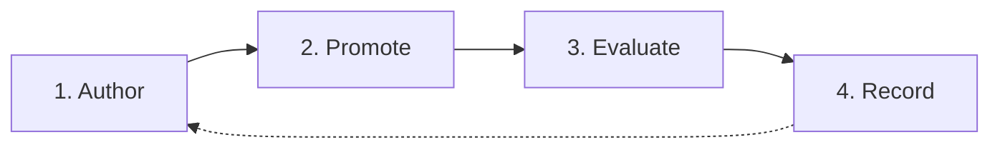
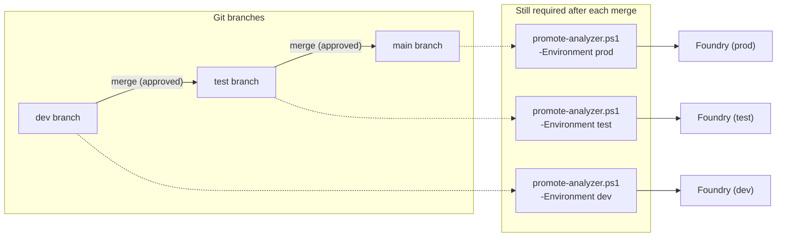
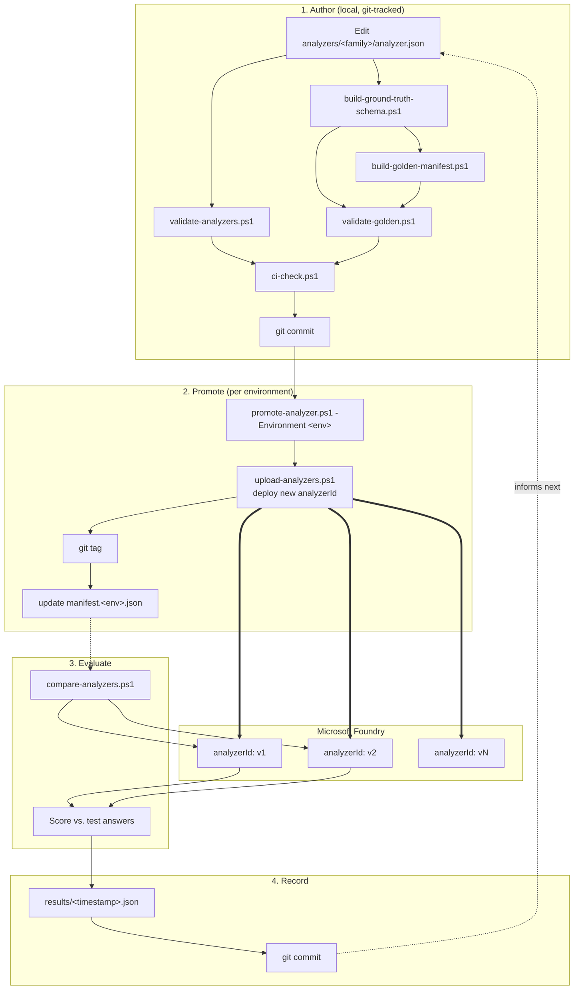

# MLOps Pipeline

How this repo takes an analyzer from an idea to a tested, deployed version — and keeps a
history of everything.

---

## Studio vs. this repo

| | Foundry Studio | This repo |
|---|---|---|
| Good for | Quick experiments | Anything real |
| Has version history? | No | Yes (git) |
| Has repeatable tests? | No | Yes (golden test set) |
| Should you trust it long-term? | No | Yes |

**Rule of thumb:** prototype in Studio → once it works, copy it into `analyzer.json` → from
then on, only this repo's scripts should touch that analyzer.

---

## The 4 stages

### 1. Author
Edit `analyzer.json` and its test data, just like any code change.
- `analyzer.json` is the **single source of truth** for one document type (a "family", e.g.
  `invoice`). It defines the schema: which fields to extract (`InvoiceNumber`, `TotalAmount`,
  ...), their types, and any extraction hints.
- Nothing is deployed yet at this point — it's just a file in git.
- Checked automatically by `ci-check.ps1`, which runs two validations:
  - `validate-analyzers.ps1` checks `analyzer.json` itself matches the required shape
    (`schemas/analyzer.schema.json`) — catches typos in field names/types before you deploy.
  - `validate-golden.ps1` checks the test documents in `analyzers/<family>/golden/` are
    consistent: every `<name>.pdf` has a matching `<name>.expected.json` (the "correct
    answers"), and each `expected.json` matches the schema derived from `analyzer.json`.
- Lives in `analyzers/<family>/analyzer.json`

### 2. Promote
Deploy the current `analyzer.json` to Microsoft Foundry as a **new, permanent version**
**in one environment**. This is the only step that actually talks to Azure.
- Run with: `promote-analyzer.ps1 -Environment dev -Family <family>`
- What it does, step by step:
  1. Refuses to run if `analyzer.json` has uncommitted changes (so every deployed version maps
     back to an exact, reviewable git commit).
  2. Looks up the next version number for *this environment* by reading
     `manifest.<env>.json` and adding 1 to the highest existing version.
  3. Uploads `analyzer.json` to the Foundry account as a **brand-new analyzer** with a new ID,
     e.g. `invoicev3` — it never overwrites `invoicev2`. Both stay live in Azure side by side.
  4. Creates a git tag `<family>-<environment>-v<N>` (e.g. `invoice-dev-v3`) at the current
     commit, so you can always find the exact source code behind any deployed analyzer.
  5. Appends a new entry to that environment's `manifest.<env>.json` and marks it `current`.
- Only deploys to the environment you pass — promoting to `dev` never touches `test`/`prod`,
  because each environment is a completely separate Foundry account with its own endpoint.

### 3. Evaluate
Run the test documents through one or more live versions and score the results.
- Run with: `compare-analyzers.ps1 -Environment dev -Family <family> -AnalyzerIds v1,v2`
- What it does, step by step:
  1. For every `<name>.pdf` in `analyzers/<family>/golden/`, sends the document to each
     analyzer ID you listed, using Azure's `analyzeBinary` API, then polls until Azure finishes
     processing it.
  2. Flattens Azure's response into plain field values (e.g. `TotalAmount: 2904.24`).
  3. Compares each field against the matching `<name>.expected.json` "correct answer" —
     numbers within a small tolerance, text ignoring case/whitespace, and item-by-item for
     list fields.
  4. Prints a table per document (`OK` / mismatch per field) and an overall
     `X/Y fields matched (Z%)` score per analyzer, so you can directly compare e.g. `invoicev1`
     vs `invoicev2` and see whether the new version is actually better.

### 4. Record
Every comparison is saved as a JSON file and committed to git.
- Saved to `analyzers/<family>/results/<timestamp>_<environment>_<analyzerIds>.json`
- The file records the full per-field results and the overall score, so `git log` on that
  folder is literally a history of accuracy over time — no separate dashboard needed.

---

## Multiple environments (dev/test/prod)

Each environment is its own **separate Foundry account** — a completely different Azure
resource, with its own endpoint (listed in [`environments.json`](../environments.json)),
its own set of deployed `analyzerId`s, and its own `manifest.<env>.json` per family. They
don't share anything at runtime; `dev`'s `invoicev2` and `test`'s `invoicev2` (if it exists)
are two unrelated deployments that happen to share a name.

**The key thing to remember:** a git branch merge (e.g. `dev` → `test`) only moves the
`analyzer.json` file between branches on GitHub — it does **not** call Azure, and it does
**not** create the analyzer in the target environment's account. Promotion is a separate,
explicit step that must be re-run per environment, using that environment's `manifest.<env>.json`
to track versions independently:

If you try to run/compare an analyzer in an environment before promoting it there, the request
will fail (the `analyzerId` doesn't exist yet) — that failure is a useful signal that a
promotion step was missed, not a bug.

---

## What's in the toolbox

| Tool | What it does |
|---|---|
| `promote-analyzer.ps1` | Deploys `analyzer.json` as a new version, in one environment |
| `compare-analyzers.ps1` | Scores one or more versions against test documents, in one environment |
| `upload-analyzers.ps1` | Low-level deploy step (used internally by promote) |
| `ci-check.ps1` | Runs all validation checks in one command |
| `validate-analyzers.ps1` | Checks `analyzer.json` is valid |
| `validate-golden.ps1` | Checks the test data is valid and matches the schema |

| File | What it's for |
|---|---|
| `analyzers/<family>/analyzer.json` | The analyzer definition (the thing you edit) |
| `analyzers/<family>/manifest.<env>.json` | Which version is currently live, per environment |
| `analyzers/<family>/golden/` | Test documents + correct answers |
| `analyzers/<family>/results/` | Saved accuracy reports (per environment) |
| `environments.json` | Environment name → Foundry endpoint mapping |

---

## How versioning works

- `analyzer.json` is **edited like normal code** — git tracks its full history via normal
  commits. There's no `analyzer-v2.json`, `analyzer-v3.json`, etc. — one file, one history.
- Azure has no concept of "editing" an analyzer in place — each promotion creates a
  brand-new, permanent `analyzerId` (`invoicev1`, `invoicev2`, ...). Old ones are never deleted
  or overwritten, so you can always roll back by pointing traffic at an older `analyzerId`, or
  compare old vs. new side by side.
- `manifest.<env>.json` is the map between the two: it lists every promotion (version number,
  `analyzerId`, git commit, git tag, date, notes) and always says which one is `current` for
  that environment. It's fully auto-generated by `promote-analyzer.ps1` — never edit it by
  hand, or the record will drift from what's actually deployed.

## How the quality check works

`compare-analyzers.ps1` runs the same test documents through two (or more) live `analyzerId`s
and shows a side-by-side score for each. Under the hood this is calling Azure's real
`analyzeBinary` API (the same one used in production) — it's not a mock or a local simulation,
so the score reflects exactly what Azure would extract for a real document. Because every
result is saved as a JSON file and committed to git, you can see accuracy trends over time
with a normal `git log analyzers/<family>/results/`.

---

Show full technical diagram

---

## Ideas for later (not built yet — this is a lab)

- **Block bad promotions** — stop `promote-analyzer.ps1` if accuracy drops vs. the current version
- **Automate the checks** — run `ci-check.ps1` automatically on every pull request
- **Auto-promote on merge** — trigger `promote-analyzer.ps1 -Environment <env>` automatically
  in CI when a branch merges to that environment's branch, instead of relying on someone to
  remember to run it manually
- **Drift detection** — catch it automatically if someone edits an analyzer in Studio instead
  of through this pipeline
