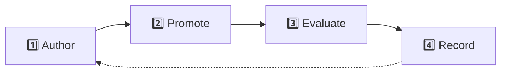
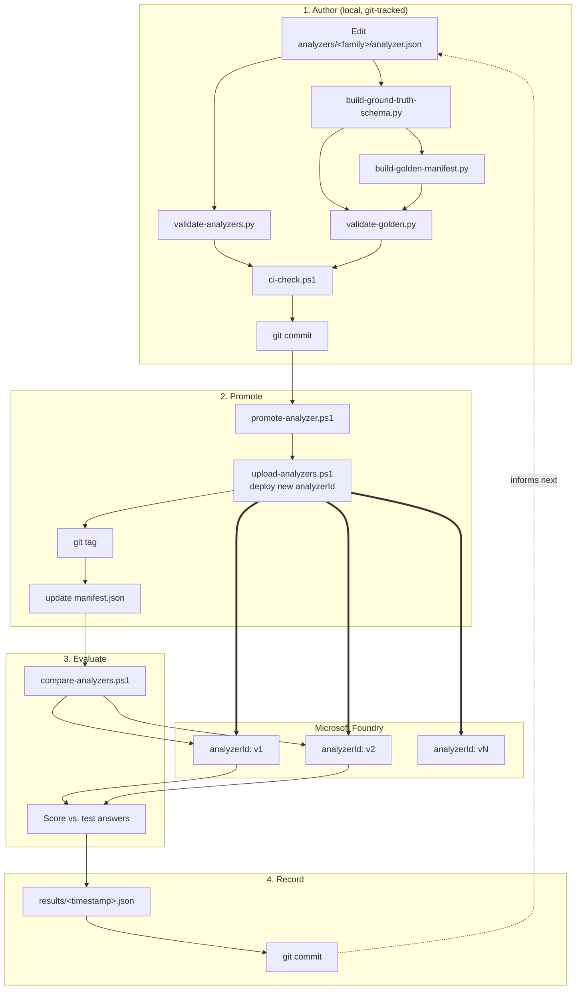

# MLOps Pipeline

How this repo takes an analyzer from an idea to a tested, deployed version — and keeps a
history of everything.

---

## 🎯 Studio vs. this repo

| | Foundry Studio | This repo |
|---|---|---|
| Good for | Quick experiments | Anything real |
| Has version history? | ❌ No | ✅ Yes (git) |
| Has repeatable tests? | ❌ No | ✅ Yes (golden test set) |
| Should you trust it long-term? | ❌ No | ✅ Yes |

**Rule of thumb:** prototype in Studio → once it works, copy it into `analyzer.json` → from
then on, only this repo's scripts should touch that analyzer.

---

## 🔄 The 4 stages

### 1️⃣ Author
Edit `analyzer.json` and its test data, just like any code change.
- ✅ Checked automatically by `ci-check.ps1`
- 📍 Lives in `analyzers/<family>/analyzer.json`

### 2️⃣ Promote
Deploy the current `analyzer.json` to Microsoft Foundry as a **new, permanent version**.
- 🚀 Run with: `promote-analyzer.ps1 -Family <family>`
- Creates a new `analyzerId` (e.g. `invoicev3`) — old versions are never overwritten
- Tags the git commit and updates `manifest.json` (so you always know what's live)

### 3️⃣ Evaluate
Run the test documents through one or more live versions and score the results.
- 📊 Run with: `compare-analyzers.ps1 -Family <family> -AnalyzerIds v1,v2`
- Compares extracted fields against known-correct answers
- Great for checking a new version didn't break anything

### 4️⃣ Record
Every comparison is saved as a JSON file and committed to git.
- 📁 Saved to `analyzers/<family>/results/`
- Lets you track accuracy over time just by looking at git history

---

## 🧰 What's in the toolbox

| Tool | What it does |
|---|---|
| `promote-analyzer.ps1` | Deploys `analyzer.json` as a new version |
| `compare-analyzers.ps1` | Scores one or more versions against test documents |
| `upload-analyzers.ps1` | Low-level deploy step (used internally by promote) |
| `ci-check.ps1` | Runs all validation checks in one command |
| `validate-analyzers.py` | Checks `analyzer.json` is valid |
| `validate-golden.py` | Checks the test data is valid and matches the schema |

| File | What it's for |
|---|---|
| `analyzers/<family>/analyzer.json` | The analyzer definition (the thing you edit) |
| `analyzers/<family>/manifest.json` | Which version is currently live |
| `analyzers/<family>/golden/` | Test documents + correct answers |
| `analyzers/<family>/results/` | Saved accuracy reports |

---

## 🔍 How versioning works

- `analyzer.json` is **edited like normal code** — git tracks its full history.
- Azure doesn't understand "versions" — each promotion just creates a brand-new,
  permanent `analyzerId` (like `invoicev1`, `invoicev2`, ...). Old ones are never deleted.
- `manifest.json` always says which one is `current`. It's auto-generated — never edit it
  by hand.

## 🔍 How the quality check works

`compare-analyzers.ps1` runs the same test documents through two (or more) versions and shows
a side-by-side score. Because every result is saved to git, you can see accuracy trends over
time with a normal `git log`.

---

Show full technical diagram

---

## 💡 Ideas for later (not built yet — this is a lab)

- **Block bad promotions** — stop `promote-analyzer.ps1` if accuracy drops vs. the current version
- **Automate the checks** — run `ci-check.ps1` automatically on every pull request
- **Multiple environments** — separate dev/test/prod Foundry accounts (not needed yet)
- **Drift detection** — catch it automatically if someone edits an analyzer in Studio instead
  of through this pipeline
